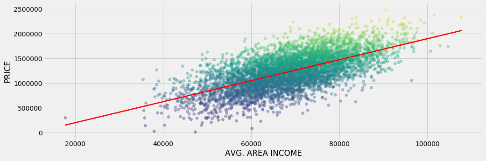
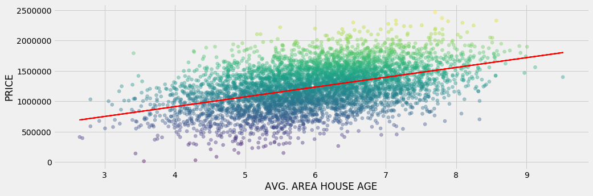
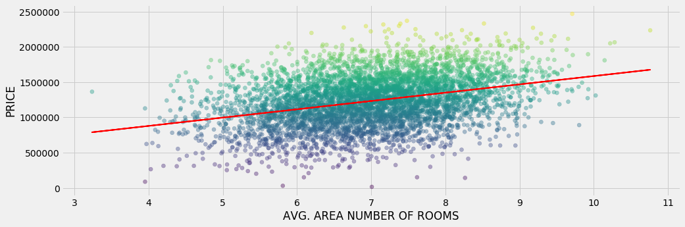
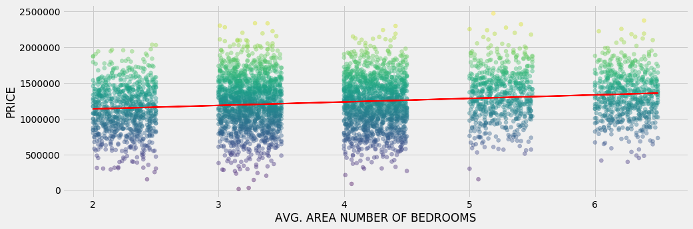
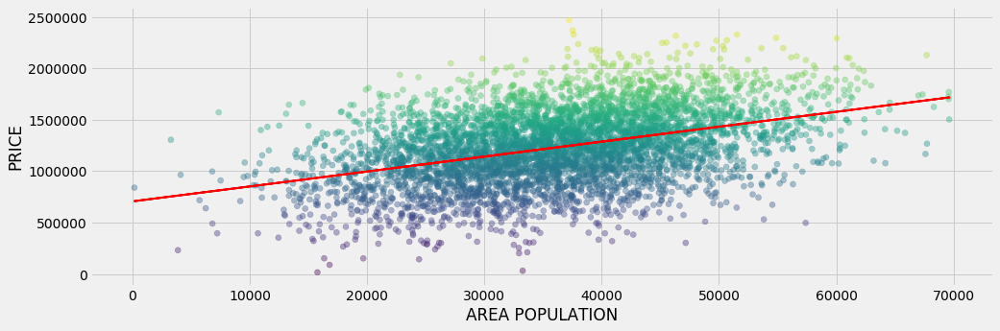
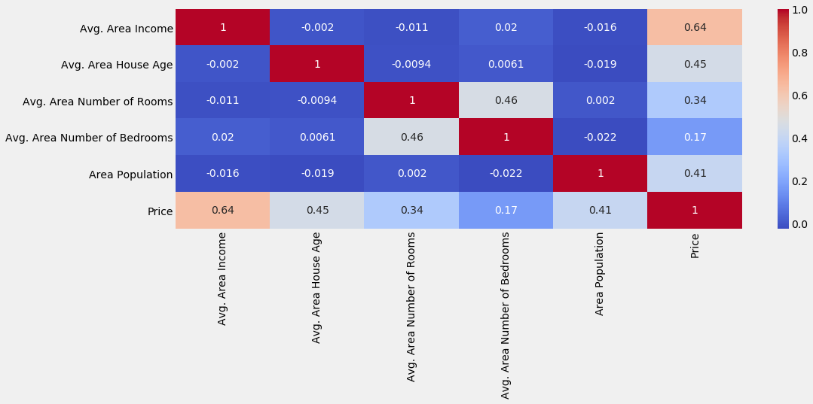
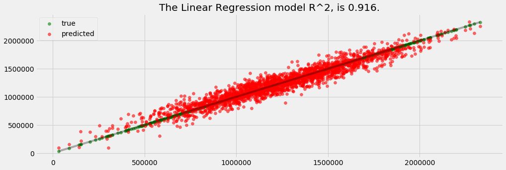
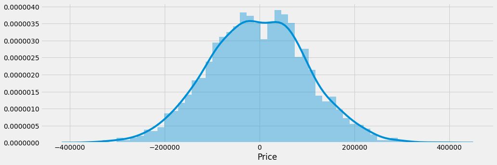

___

# Data and Machine Learning Models Analysis Template
___


___
## Imports section


```python
# data analysis
import numpy as np
import matplotlib.pyplot as plt
import pandas as pd

# ploting
import seaborn as sns
import matplotlib.pyplot as plt
%matplotlib inline
plt.style.use('fivethirtyeight')
plt.rcParams['figure.figsize'] = (15,5)

# data preprocesing
from sklearn.preprocessing import Imputer #replace missing data
from sklearn.preprocessing import LabelEncoder, OneHotEncoder #encoding categorical data
from sklearn.preprocessing import StandardScaler #feature scaling

#spliting data
from sklearn.cross_validation import train_test_split

#models
from sklearn.linear_model import LinearRegression

# metrics
from sklearn.metrics import r2_score# data analysis
import numpy as np
import matplotlib.pyplot as plt
import pandas as pd

# ploting
import seaborn as sns
import matplotlib.pyplot as plt
%matplotlib inline
plt.style.use('fivethirtyeight')
plt.rcParams['figure.figsize'] = (15,5)

# data preprocesing
from sklearn.preprocessing import Imputer #replace missing data
from sklearn.preprocessing import LabelEncoder, OneHotEncoder #encoding categorical data
from sklearn.preprocessing import StandardScaler #feature scaling

#spliting data
from sklearn.cross_validation import train_test_split

#models
from sklearn.linear_model import LinearRegression

# metrics
from sklearn.metrics import r2_score, mean_absolute_error, mean_squared_error
from math import sqrt
```

___
## Data Exploring


```python
df = pd.read_csv('template_data.csv');
df.head()
```


<div>
<style>
    .dataframe thead tr:only-child th {
        text-align: right;
    }

    .dataframe thead th {
        text-align: left;
    }

    .dataframe tbody tr th {
        vertical-align: top;
    }
</style>
<table border="1" class="dataframe">
  <thead>
    <tr style="text-align: right;">
      <th></th>
      <th>Avg. Area Income</th>
      <th>Avg. Area House Age</th>
      <th>Avg. Area Number of Rooms</th>
      <th>Avg. Area Number of Bedrooms</th>
      <th>Area Population</th>
      <th>Price</th>
      <th>Address</th>
      <th>State</th>
    </tr>
  </thead>
  <tbody>
    <tr>
      <th>0</th>
      <td>79545.458574</td>
      <td>5.682861</td>
      <td>7.009188</td>
      <td>4.09</td>
      <td>23086.800503</td>
      <td>1.059034e+06</td>
      <td>208,Michael,Ferry,Apt.,674Laurabury,NE,37010-5101</td>
      <td>NE</td>
    </tr>
    <tr>
      <th>1</th>
      <td>79248.642455</td>
      <td>6.002900</td>
      <td>6.730821</td>
      <td>3.09</td>
      <td>40173.072174</td>
      <td>1.505891e+06</td>
      <td>188,Johnson,Views,Suite,079Lake,Kathleen,CA,48958</td>
      <td>CA</td>
    </tr>
    <tr>
      <th>2</th>
      <td>61287.067179</td>
      <td>5.865890</td>
      <td>8.512727</td>
      <td>5.13</td>
      <td>36882.159400</td>
      <td>1.058988e+06</td>
      <td>9127,Elizabeth,StravenueDanieltown,WI,06482-3489</td>
      <td>WI</td>
    </tr>
    <tr>
      <th>3</th>
      <td>63345.240046</td>
      <td>7.188236</td>
      <td>5.586729</td>
      <td>3.26</td>
      <td>34310.242831</td>
      <td>1.260617e+06</td>
      <td>USS,BarnettFPO,AP,44820</td>
      <td>AP</td>
    </tr>
    <tr>
      <th>4</th>
      <td>59982.197226</td>
      <td>5.040555</td>
      <td>7.839388</td>
      <td>4.23</td>
      <td>26354.109472</td>
      <td>6.309435e+05</td>
      <td>USNS,RaymondFPO,AE,09386</td>
      <td>AE</td>
    </tr>
  </tbody>
</table>
</div>


### Data Info


```python
df.info()
```

    <class 'pandas.core.frame.DataFrame'>
    RangeIndex: 5000 entries, 0 to 4999
    Data columns (total 8 columns):
    Avg. Area Income                5000 non-null float64
    Avg. Area House Age             5000 non-null float64
    Avg. Area Number of Rooms       5000 non-null float64
    Avg. Area Number of Bedrooms    5000 non-null float64
    Area Population                 5000 non-null float64
    Price                           5000 non-null float64
    Address                         5000 non-null object
    State                           5000 non-null object
    dtypes: float64(6), object(2)
    memory usage: 312.6+ KB
    

### Data Describe


```python
df.describe()
```


<div>
<style>
    .dataframe thead tr:only-child th {
        text-align: right;
    }

    .dataframe thead th {
        text-align: left;
    }

    .dataframe tbody tr th {
        vertical-align: top;
    }
</style>
<table border="1" class="dataframe">
  <thead>
    <tr style="text-align: right;">
      <th></th>
      <th>Avg. Area Income</th>
      <th>Avg. Area House Age</th>
      <th>Avg. Area Number of Rooms</th>
      <th>Avg. Area Number of Bedrooms</th>
      <th>Area Population</th>
      <th>Price</th>
    </tr>
  </thead>
  <tbody>
    <tr>
      <th>count</th>
      <td>5000.000000</td>
      <td>5000.000000</td>
      <td>5000.000000</td>
      <td>5000.000000</td>
      <td>5000.000000</td>
      <td>5.000000e+03</td>
    </tr>
    <tr>
      <th>mean</th>
      <td>68583.108984</td>
      <td>5.977222</td>
      <td>6.987792</td>
      <td>3.981330</td>
      <td>36163.516039</td>
      <td>1.232073e+06</td>
    </tr>
    <tr>
      <th>std</th>
      <td>10657.991214</td>
      <td>0.991456</td>
      <td>1.005833</td>
      <td>1.234137</td>
      <td>9925.650114</td>
      <td>3.531176e+05</td>
    </tr>
    <tr>
      <th>min</th>
      <td>17796.631190</td>
      <td>2.644304</td>
      <td>3.236194</td>
      <td>2.000000</td>
      <td>172.610686</td>
      <td>1.593866e+04</td>
    </tr>
    <tr>
      <th>25%</th>
      <td>61480.562388</td>
      <td>5.322283</td>
      <td>6.299250</td>
      <td>3.140000</td>
      <td>29403.928702</td>
      <td>9.975771e+05</td>
    </tr>
    <tr>
      <th>50%</th>
      <td>68804.286404</td>
      <td>5.970429</td>
      <td>7.002902</td>
      <td>4.050000</td>
      <td>36199.406689</td>
      <td>1.232669e+06</td>
    </tr>
    <tr>
      <th>75%</th>
      <td>75783.338666</td>
      <td>6.650808</td>
      <td>7.665871</td>
      <td>4.490000</td>
      <td>42861.290769</td>
      <td>1.471210e+06</td>
    </tr>
    <tr>
      <th>max</th>
      <td>107701.748378</td>
      <td>9.519088</td>
      <td>10.759588</td>
      <td>6.500000</td>
      <td>69621.713378</td>
      <td>2.469066e+06</td>
    </tr>
  </tbody>
</table>
</div>


### Histogram


```python
sns.distplot(df['Price'])
```


    <matplotlib.axes._subplots.AxesSubplot at 0x263cf33d860>


### Correlation


```python
df.corr()
```


<div>
<style>
    .dataframe thead tr:only-child th {
        text-align: right;
    }

    .dataframe thead th {
        text-align: left;
    }

    .dataframe tbody tr th {
        vertical-align: top;
    }
</style>
<table border="1" class="dataframe">
  <thead>
    <tr style="text-align: right;">
      <th></th>
      <th>Avg. Area Income</th>
      <th>Avg. Area House Age</th>
      <th>Avg. Area Number of Rooms</th>
      <th>Avg. Area Number of Bedrooms</th>
      <th>Area Population</th>
      <th>Price</th>
    </tr>
  </thead>
  <tbody>
    <tr>
      <th>Avg. Area Income</th>
      <td>1.000000</td>
      <td>-0.002007</td>
      <td>-0.011032</td>
      <td>0.019788</td>
      <td>-0.016234</td>
      <td>0.639734</td>
    </tr>
    <tr>
      <th>Avg. Area House Age</th>
      <td>-0.002007</td>
      <td>1.000000</td>
      <td>-0.009428</td>
      <td>0.006149</td>
      <td>-0.018743</td>
      <td>0.452543</td>
    </tr>
    <tr>
      <th>Avg. Area Number of Rooms</th>
      <td>-0.011032</td>
      <td>-0.009428</td>
      <td>1.000000</td>
      <td>0.462695</td>
      <td>0.002040</td>
      <td>0.335664</td>
    </tr>
    <tr>
      <th>Avg. Area Number of Bedrooms</th>
      <td>0.019788</td>
      <td>0.006149</td>
      <td>0.462695</td>
      <td>1.000000</td>
      <td>-0.022168</td>
      <td>0.171071</td>
    </tr>
    <tr>
      <th>Area Population</th>
      <td>-0.016234</td>
      <td>-0.018743</td>
      <td>0.002040</td>
      <td>-0.022168</td>
      <td>1.000000</td>
      <td>0.408556</td>
    </tr>
    <tr>
      <th>Price</th>
      <td>0.639734</td>
      <td>0.452543</td>
      <td>0.335664</td>
      <td>0.171071</td>
      <td>0.408556</td>
      <td>1.000000</td>
    </tr>
  </tbody>
</table>
</div>


```python
def show_corr(data, ylabel):
    for columnName in df.columns.values.tolist():
        column = data[columnName]
        if column.dtype == "object" or columnName == ylabel:
            continue
        column = column.reshape(-1,1)
        xlabel = columnName.upper()
        y = data[ylabel]
        model = LinearRegression()
        model.fit(column, y)
        predictions =  model.predict(column)
        plt.plot(column, predictions, color='red', linewidth=2)
        plt.scatter(column, y, alpha=0.4, c=y)
        plt.xlabel(xlabel)
        plt.ylabel(ylabel.upper())
        plt.show()
```


```python
show_corr(df,"Price")
```

    C:\ProgramData\Anaconda3\lib\site-packages\ipykernel_launcher.py:6: FutureWarning: reshape is deprecated and will raise in a subsequent release. Please use .values.reshape(...) instead
      
    

















### Heatmap


```python
sns.heatmap(data=df.corr(),cmap="coolwarm",annot=True)
```


    <matplotlib.axes._subplots.AxesSubplot at 0x263d302d630>





## Statistics


```python
def show_data_set_stats(y):
    values = y.values
    min_value= np.min(values)
    max_value= np.max(values)
    mean_value= np.mean(values)
    median_value= np.median(values)
    std_values = np.std(values)
    print ("Min                : {:,.2f}".format(min_value))
    print ("Max                : {:,.2f}".format(max_value))
    print ("Mean               : {:,.2f}".format(mean_value))
    print ("Median             : {:,.2f}".format(median_value))
    print ("Standard Deviation : {:,.2f}".format(std_values))    
```


```python
show_data_set_stats(df['Price'])
```

    Min                : 15,938.66
    Max                : 2,469,065.59
    Mean               : 1,232,072.65
    Median             : 1,232,669.38
    Standard Deviation : 353,082.31
    

___
## Data Processing

### Separation: X (features) from Y (predict variable)


```python
df.columns
```


    Index(['Avg. Area Income', 'Avg. Area House Age', 'Avg. Area Number of Rooms',
           'Avg. Area Number of Bedrooms', 'Area Population', 'Price', 'Address',
           'State'],
          dtype='object')


```python
y = df['Price']
X = df[['Avg. Area Income', 'Avg. Area House Age', 'Avg. Area Number of Rooms',
       'Avg. Area Number of Bedrooms', 'Area Population','State']].values #address is not relavant for this
```

### Dealing with Missing Data


```python
# this should be used with careful so the predictions are note affected
# this data set does not have missing data, bu supose we have in one of the columns
# by default: missing_values='NaN', strategy='mean', that means replace NaN valuues with the column mean
imputer = Imputer(axis=0)
imputer = imputer.fit(X[:,0:1])
X[:,0:1] = imputer.transform(X[:,0:1])
```

### Encoding Categorical Data


```python
label_enconder = LabelEncoder()
# categorizing the State column as number values
X[:,5] = label_enconder.fit_transform(X[:,5])
pd.DataFrame(X).head()
```


<div>
<style>
    .dataframe thead tr:only-child th {
        text-align: right;
    }

    .dataframe thead th {
        text-align: left;
    }

    .dataframe tbody tr th {
        vertical-align: top;
    }
</style>
<table border="1" class="dataframe">
  <thead>
    <tr style="text-align: right;">
      <th></th>
      <th>0</th>
      <th>1</th>
      <th>2</th>
      <th>3</th>
      <th>4</th>
      <th>5</th>
    </tr>
  </thead>
  <tbody>
    <tr>
      <th>0</th>
      <td>79545.5</td>
      <td>5.68286</td>
      <td>7.00919</td>
      <td>4.09</td>
      <td>23086.8</td>
      <td>37</td>
    </tr>
    <tr>
      <th>1</th>
      <td>79248.6</td>
      <td>6.0029</td>
      <td>6.73082</td>
      <td>3.09</td>
      <td>40173.1</td>
      <td>8</td>
    </tr>
    <tr>
      <th>2</th>
      <td>61287.1</td>
      <td>5.86589</td>
      <td>8.51273</td>
      <td>5.13</td>
      <td>36882.2</td>
      <td>59</td>
    </tr>
    <tr>
      <th>3</th>
      <td>63345.2</td>
      <td>7.18824</td>
      <td>5.58673</td>
      <td>3.26</td>
      <td>34310.2</td>
      <td>4</td>
    </tr>
    <tr>
      <th>4</th>
      <td>59982.2</td>
      <td>5.04055</td>
      <td>7.83939</td>
      <td>4.23</td>
      <td>26354.1</td>
      <td>1</td>
    </tr>
  </tbody>
</table>
</div>


```python
# So the ML algorithm do not thing each state has a bigger value then the 
#other categorize using one hot. A colum for each country will be created 
#with a 0 or 1 value (dummy enconding)
onehot_encoder = OneHotEncoder(categorical_features=[5]) 
X = onehot_encoder.fit_transform(X).toarray() 
pd.DataFrame(X).head()
```


<div>
<style>
    .dataframe thead tr:only-child th {
        text-align: right;
    }

    .dataframe thead th {
        text-align: left;
    }

    .dataframe tbody tr th {
        vertical-align: top;
    }
</style>
<table border="1" class="dataframe">
  <thead>
    <tr style="text-align: right;">
      <th></th>
      <th>0</th>
      <th>1</th>
      <th>2</th>
      <th>3</th>
      <th>4</th>
      <th>5</th>
      <th>6</th>
      <th>7</th>
      <th>8</th>
      <th>9</th>
      <th>...</th>
      <th>57</th>
      <th>58</th>
      <th>59</th>
      <th>60</th>
      <th>61</th>
      <th>62</th>
      <th>63</th>
      <th>64</th>
      <th>65</th>
      <th>66</th>
    </tr>
  </thead>
  <tbody>
    <tr>
      <th>0</th>
      <td>0.0</td>
      <td>0.0</td>
      <td>0.0</td>
      <td>0.0</td>
      <td>0.0</td>
      <td>0.0</td>
      <td>0.0</td>
      <td>0.0</td>
      <td>0.0</td>
      <td>0.0</td>
      <td>...</td>
      <td>0.0</td>
      <td>0.0</td>
      <td>0.0</td>
      <td>0.0</td>
      <td>0.0</td>
      <td>79545.458574</td>
      <td>5.682861</td>
      <td>7.009188</td>
      <td>4.09</td>
      <td>23086.800503</td>
    </tr>
    <tr>
      <th>1</th>
      <td>0.0</td>
      <td>0.0</td>
      <td>0.0</td>
      <td>0.0</td>
      <td>0.0</td>
      <td>0.0</td>
      <td>0.0</td>
      <td>0.0</td>
      <td>1.0</td>
      <td>0.0</td>
      <td>...</td>
      <td>0.0</td>
      <td>0.0</td>
      <td>0.0</td>
      <td>0.0</td>
      <td>0.0</td>
      <td>79248.642455</td>
      <td>6.002900</td>
      <td>6.730821</td>
      <td>3.09</td>
      <td>40173.072174</td>
    </tr>
    <tr>
      <th>2</th>
      <td>0.0</td>
      <td>0.0</td>
      <td>0.0</td>
      <td>0.0</td>
      <td>0.0</td>
      <td>0.0</td>
      <td>0.0</td>
      <td>0.0</td>
      <td>0.0</td>
      <td>0.0</td>
      <td>...</td>
      <td>0.0</td>
      <td>0.0</td>
      <td>1.0</td>
      <td>0.0</td>
      <td>0.0</td>
      <td>61287.067179</td>
      <td>5.865890</td>
      <td>8.512727</td>
      <td>5.13</td>
      <td>36882.159400</td>
    </tr>
    <tr>
      <th>3</th>
      <td>0.0</td>
      <td>0.0</td>
      <td>0.0</td>
      <td>0.0</td>
      <td>1.0</td>
      <td>0.0</td>
      <td>0.0</td>
      <td>0.0</td>
      <td>0.0</td>
      <td>0.0</td>
      <td>...</td>
      <td>0.0</td>
      <td>0.0</td>
      <td>0.0</td>
      <td>0.0</td>
      <td>0.0</td>
      <td>63345.240046</td>
      <td>7.188236</td>
      <td>5.586729</td>
      <td>3.26</td>
      <td>34310.242831</td>
    </tr>
    <tr>
      <th>4</th>
      <td>0.0</td>
      <td>1.0</td>
      <td>0.0</td>
      <td>0.0</td>
      <td>0.0</td>
      <td>0.0</td>
      <td>0.0</td>
      <td>0.0</td>
      <td>0.0</td>
      <td>0.0</td>
      <td>...</td>
      <td>0.0</td>
      <td>0.0</td>
      <td>0.0</td>
      <td>0.0</td>
      <td>0.0</td>
      <td>59982.197226</td>
      <td>5.040555</td>
      <td>7.839388</td>
      <td>4.23</td>
      <td>26354.109472</td>
    </tr>
  </tbody>
</table>
<p>5 rows × 67 columns</p>
</div>


```python
#showing the transformations
columns = []
for i in range(62):
    columns.append("State " + str(i))

nc = np.array(columns)
col = ['Avg. Area Income', 'Avg. Area House Age', 'Avg. Area Number of Rooms','Avg. Area Number of Bedrooms', 'Area Population']
col = np.array(col)
np_columns = np.concatenate((nc,col))
pd.DataFrame(data=X, columns=np_columns).head()
```


<div>
<style>
    .dataframe thead tr:only-child th {
        text-align: right;
    }

    .dataframe thead th {
        text-align: left;
    }

    .dataframe tbody tr th {
        vertical-align: top;
    }
</style>
<table border="1" class="dataframe">
  <thead>
    <tr style="text-align: right;">
      <th></th>
      <th>State 0</th>
      <th>State 1</th>
      <th>State 2</th>
      <th>State 3</th>
      <th>State 4</th>
      <th>State 5</th>
      <th>State 6</th>
      <th>State 7</th>
      <th>State 8</th>
      <th>State 9</th>
      <th>...</th>
      <th>State 57</th>
      <th>State 58</th>
      <th>State 59</th>
      <th>State 60</th>
      <th>State 61</th>
      <th>Avg. Area Income</th>
      <th>Avg. Area House Age</th>
      <th>Avg. Area Number of Rooms</th>
      <th>Avg. Area Number of Bedrooms</th>
      <th>Area Population</th>
    </tr>
  </thead>
  <tbody>
    <tr>
      <th>0</th>
      <td>0.0</td>
      <td>0.0</td>
      <td>0.0</td>
      <td>0.0</td>
      <td>0.0</td>
      <td>0.0</td>
      <td>0.0</td>
      <td>0.0</td>
      <td>0.0</td>
      <td>0.0</td>
      <td>...</td>
      <td>0.0</td>
      <td>0.0</td>
      <td>0.0</td>
      <td>0.0</td>
      <td>0.0</td>
      <td>79545.458574</td>
      <td>5.682861</td>
      <td>7.009188</td>
      <td>4.09</td>
      <td>23086.800503</td>
    </tr>
    <tr>
      <th>1</th>
      <td>0.0</td>
      <td>0.0</td>
      <td>0.0</td>
      <td>0.0</td>
      <td>0.0</td>
      <td>0.0</td>
      <td>0.0</td>
      <td>0.0</td>
      <td>1.0</td>
      <td>0.0</td>
      <td>...</td>
      <td>0.0</td>
      <td>0.0</td>
      <td>0.0</td>
      <td>0.0</td>
      <td>0.0</td>
      <td>79248.642455</td>
      <td>6.002900</td>
      <td>6.730821</td>
      <td>3.09</td>
      <td>40173.072174</td>
    </tr>
    <tr>
      <th>2</th>
      <td>0.0</td>
      <td>0.0</td>
      <td>0.0</td>
      <td>0.0</td>
      <td>0.0</td>
      <td>0.0</td>
      <td>0.0</td>
      <td>0.0</td>
      <td>0.0</td>
      <td>0.0</td>
      <td>...</td>
      <td>0.0</td>
      <td>0.0</td>
      <td>1.0</td>
      <td>0.0</td>
      <td>0.0</td>
      <td>61287.067179</td>
      <td>5.865890</td>
      <td>8.512727</td>
      <td>5.13</td>
      <td>36882.159400</td>
    </tr>
    <tr>
      <th>3</th>
      <td>0.0</td>
      <td>0.0</td>
      <td>0.0</td>
      <td>0.0</td>
      <td>1.0</td>
      <td>0.0</td>
      <td>0.0</td>
      <td>0.0</td>
      <td>0.0</td>
      <td>0.0</td>
      <td>...</td>
      <td>0.0</td>
      <td>0.0</td>
      <td>0.0</td>
      <td>0.0</td>
      <td>0.0</td>
      <td>63345.240046</td>
      <td>7.188236</td>
      <td>5.586729</td>
      <td>3.26</td>
      <td>34310.242831</td>
    </tr>
    <tr>
      <th>4</th>
      <td>0.0</td>
      <td>1.0</td>
      <td>0.0</td>
      <td>0.0</td>
      <td>0.0</td>
      <td>0.0</td>
      <td>0.0</td>
      <td>0.0</td>
      <td>0.0</td>
      <td>0.0</td>
      <td>...</td>
      <td>0.0</td>
      <td>0.0</td>
      <td>0.0</td>
      <td>0.0</td>
      <td>0.0</td>
      <td>59982.197226</td>
      <td>5.040555</td>
      <td>7.839388</td>
      <td>4.23</td>
      <td>26354.109472</td>
    </tr>
  </tbody>
</table>
<p>5 rows × 67 columns</p>
</div>


### Feature Scaling


```python
scaler_X = StandardScaler()
X = scaler_X.fit_transform(X)
pd.DataFrame(data=X, columns=np_columns).head()
```


<div>
<style>
    .dataframe thead tr:only-child th {
        text-align: right;
    }

    .dataframe thead th {
        text-align: left;
    }

    .dataframe tbody tr th {
        vertical-align: top;
    }
</style>
<table border="1" class="dataframe">
  <thead>
    <tr style="text-align: right;">
      <th></th>
      <th>State 0</th>
      <th>State 1</th>
      <th>State 2</th>
      <th>State 3</th>
      <th>State 4</th>
      <th>State 5</th>
      <th>State 6</th>
      <th>State 7</th>
      <th>State 8</th>
      <th>State 9</th>
      <th>...</th>
      <th>State 57</th>
      <th>State 58</th>
      <th>State 59</th>
      <th>State 60</th>
      <th>State 61</th>
      <th>Avg. Area Income</th>
      <th>Avg. Area House Age</th>
      <th>Avg. Area Number of Rooms</th>
      <th>Avg. Area Number of Bedrooms</th>
      <th>Area Population</th>
    </tr>
  </thead>
  <tbody>
    <tr>
      <th>0</th>
      <td>-0.19157</td>
      <td>-0.185887</td>
      <td>-0.116542</td>
      <td>-0.119159</td>
      <td>-0.187608</td>
      <td>-0.118292</td>
      <td>-0.125886</td>
      <td>-0.132291</td>
      <td>-0.125886</td>
      <td>-0.123404</td>
      <td>...</td>
      <td>-0.132291</td>
      <td>-0.121722</td>
      <td>-0.116542</td>
      <td>-0.128323</td>
      <td>-0.123404</td>
      <td>1.028660</td>
      <td>-0.296927</td>
      <td>0.021274</td>
      <td>0.088062</td>
      <td>-1.317599</td>
    </tr>
    <tr>
      <th>1</th>
      <td>-0.19157</td>
      <td>-0.185887</td>
      <td>-0.116542</td>
      <td>-0.119159</td>
      <td>-0.187608</td>
      <td>-0.118292</td>
      <td>-0.125886</td>
      <td>-0.132291</td>
      <td>7.943712</td>
      <td>-0.123404</td>
      <td>...</td>
      <td>-0.132291</td>
      <td>-0.121722</td>
      <td>-0.116542</td>
      <td>-0.128323</td>
      <td>-0.123404</td>
      <td>1.000808</td>
      <td>0.025902</td>
      <td>-0.255506</td>
      <td>-0.722301</td>
      <td>0.403999</td>
    </tr>
    <tr>
      <th>2</th>
      <td>-0.19157</td>
      <td>-0.185887</td>
      <td>-0.116542</td>
      <td>-0.119159</td>
      <td>-0.187608</td>
      <td>-0.118292</td>
      <td>-0.125886</td>
      <td>-0.132291</td>
      <td>-0.125886</td>
      <td>-0.123404</td>
      <td>...</td>
      <td>-0.132291</td>
      <td>-0.121722</td>
      <td>8.580610</td>
      <td>-0.128323</td>
      <td>-0.123404</td>
      <td>-0.684629</td>
      <td>-0.112303</td>
      <td>1.516243</td>
      <td>0.930840</td>
      <td>0.072410</td>
    </tr>
    <tr>
      <th>3</th>
      <td>-0.19157</td>
      <td>-0.185887</td>
      <td>-0.116542</td>
      <td>-0.119159</td>
      <td>5.330269</td>
      <td>-0.118292</td>
      <td>-0.125886</td>
      <td>-0.132291</td>
      <td>-0.125886</td>
      <td>-0.123404</td>
      <td>...</td>
      <td>-0.132291</td>
      <td>-0.121722</td>
      <td>-0.116542</td>
      <td>-0.128323</td>
      <td>-0.123404</td>
      <td>-0.491499</td>
      <td>1.221572</td>
      <td>-1.393077</td>
      <td>-0.584540</td>
      <td>-0.186734</td>
    </tr>
    <tr>
      <th>4</th>
      <td>-0.19157</td>
      <td>5.379602</td>
      <td>-0.116542</td>
      <td>-0.119159</td>
      <td>-0.187608</td>
      <td>-0.118292</td>
      <td>-0.125886</td>
      <td>-0.132291</td>
      <td>-0.125886</td>
      <td>-0.123404</td>
      <td>...</td>
      <td>-0.132291</td>
      <td>-0.121722</td>
      <td>-0.116542</td>
      <td>-0.128323</td>
      <td>-0.123404</td>
      <td>-0.807073</td>
      <td>-0.944834</td>
      <td>0.846742</td>
      <td>0.201513</td>
      <td>-0.988387</td>
    </tr>
  </tbody>
</table>
<p>5 rows × 67 columns</p>
</div>


___
## Model Desing

### Model Performace Analysis


```python
def performance_metric(y_true, y_predict):
    score = r2_score(y_true, y_predict)
    return score

def plot_performance_metrics(y_true, y_predict, model_name):
    #ploting the values
    true_handle = plt.scatter(y_true, y_true, alpha=0.6, color='green', label='true')
    #reference line
    fit = np.poly1d(np.polyfit(y_true,y_true,1))
    lims = np.linspace(min(y_true) - 1, max(y_true) + 1)
    plt.plot(lims, fit(lims), alpha= 0.3, color='black')
    # plot predic valus
    pred_handle =  plt.scatter(y_true, y_predict, alpha=0.6, color='red', label='predicted')
    # legend and show
    plt.legend(handles=[true_handle, pred_handle], loc='upper left')
    score = performance_metric(y_true, y_predict)
    print ("\nThe " + model_name +" model R^2, is {:.3f}.".format(score))
    plt.title("The " + model_name +" model R^2, is {:.3f}.".format(score))
    plt.show()
```

### Spliting the Data


```python
X_train, X_test, y_train, y_test = train_test_split(X, y, test_size=0.4, random_state=101)
```

### Creating and training models


```python
linear_regressor = LinearRegression()
linear_regressor.fit(X_train, y_train)
```


    LinearRegression(copy_X=True, fit_intercept=True, n_jobs=1, normalize=False)


### Predictions


```python
linear_regressor_predictions = linear_regressor.predict(X_test)
```

### Performance


```python
plot_performance_metrics(y_test, linear_regressor_predictions, "Linear Regression")
```

    
    The Linear Regression model R^2, is 0.916.
    





### Evaluating Model


```python
r2 = r2_score(y_test, linear_regressor_predictions)
mean_absolute_error = mean_absolute_error(y_test,linear_regressor_predictions)
mean_squared_error = mean_squared_error(y_test,linear_regressor_predictions)
root_mean_squared_error = sqrt(mean_squared_error)
print("R^2  : " + str(r2))
print("MAE  : " + str(mean_absolute_error))
print("MSE  : " + str(mean_squared_error))
print("RMSE : " + str(root_mean_squared_error))
```

    R^2  : 0.915791746042
    MAE  : 83172.338835
    MSE  : 10701224217.3
    RMSE : 103446.72163630386
    

### Residuals


```python
sns.distplot((y_test-linear_regressor_predictions),bins=50);
```





## Conclusion


```python
coeff_df = pd.DataFrame(linear_regressor.coef_,np_columns,columns=['Coefficient'])
coeff_df
```


<div>
<style>
    .dataframe thead tr:only-child th {
        text-align: right;
    }

    .dataframe thead th {
        text-align: left;
    }

    .dataframe tbody tr th {
        vertical-align: top;
    }
</style>
<table border="1" class="dataframe">
  <thead>
    <tr style="text-align: right;">
      <th></th>
      <th>Coefficient</th>
    </tr>
  </thead>
  <tbody>
    <tr>
      <th>State 0</th>
      <td>3.461889e+16</td>
    </tr>
    <tr>
      <th>State 1</th>
      <td>3.366158e+16</td>
    </tr>
    <tr>
      <th>State 2</th>
      <td>2.154075e+16</td>
    </tr>
    <tr>
      <th>State 3</th>
      <td>2.201103e+16</td>
    </tr>
    <tr>
      <th>State 4</th>
      <td>3.395204e+16</td>
    </tr>
    <tr>
      <th>State 5</th>
      <td>2.185546e+16</td>
    </tr>
    <tr>
      <th>State 6</th>
      <td>2.321592e+16</td>
    </tr>
    <tr>
      <th>State 7</th>
      <td>2.435761e+16</td>
    </tr>
    <tr>
      <th>State 8</th>
      <td>2.321592e+16</td>
    </tr>
    <tr>
      <th>State 9</th>
      <td>2.277202e+16</td>
    </tr>
    <tr>
      <th>State 10</th>
      <td>2.262200e+16</td>
    </tr>
    <tr>
      <th>State 11</th>
      <td>2.365096e+16</td>
    </tr>
    <tr>
      <th>State 12</th>
      <td>2.477125e+16</td>
    </tr>
    <tr>
      <th>State 13</th>
      <td>2.277202e+16</td>
    </tr>
    <tr>
      <th>State 14</th>
      <td>2.277202e+16</td>
    </tr>
    <tr>
      <th>State 15</th>
      <td>2.350690e+16</td>
    </tr>
    <tr>
      <th>State 16</th>
      <td>2.504293e+16</td>
    </tr>
    <tr>
      <th>State 17</th>
      <td>2.201103e+16</td>
    </tr>
    <tr>
      <th>State 18</th>
      <td>2.292101e+16</td>
    </tr>
    <tr>
      <th>State 19</th>
      <td>2.365096e+16</td>
    </tr>
    <tr>
      <th>State 20</th>
      <td>2.105937e+16</td>
    </tr>
    <tr>
      <th>State 21</th>
      <td>2.350690e+16</td>
    </tr>
    <tr>
      <th>State 22</th>
      <td>2.154075e+16</td>
    </tr>
    <tr>
      <th>State 23</th>
      <td>2.477125e+16</td>
    </tr>
    <tr>
      <th>State 24</th>
      <td>2.247091e+16</td>
    </tr>
    <tr>
      <th>State 25</th>
      <td>2.306897e+16</td>
    </tr>
    <tr>
      <th>State 26</th>
      <td>2.073191e+16</td>
    </tr>
    <tr>
      <th>State 27</th>
      <td>2.277202e+16</td>
    </tr>
    <tr>
      <th>State 28</th>
      <td>2.185546e+16</td>
    </tr>
    <tr>
      <th>State 29</th>
      <td>2.306897e+16</td>
    </tr>
    <tr>
      <th>...</th>
      <td>...</td>
    </tr>
    <tr>
      <th>State 37</th>
      <td>2.407761e+16</td>
    </tr>
    <tr>
      <th>State 38</th>
      <td>2.231873e+16</td>
    </tr>
    <tr>
      <th>State 39</th>
      <td>2.216545e+16</td>
    </tr>
    <tr>
      <th>State 40</th>
      <td>2.336190e+16</td>
    </tr>
    <tr>
      <th>State 41</th>
      <td>2.201103e+16</td>
    </tr>
    <tr>
      <th>State 42</th>
      <td>2.306897e+16</td>
    </tr>
    <tr>
      <th>State 43</th>
      <td>2.231873e+16</td>
    </tr>
    <tr>
      <th>State 44</th>
      <td>2.292101e+16</td>
    </tr>
    <tr>
      <th>State 45</th>
      <td>2.504293e+16</td>
    </tr>
    <tr>
      <th>State 46</th>
      <td>2.365096e+16</td>
    </tr>
    <tr>
      <th>State 47</th>
      <td>2.247091e+16</td>
    </tr>
    <tr>
      <th>State 48</th>
      <td>2.201103e+16</td>
    </tr>
    <tr>
      <th>State 49</th>
      <td>2.216545e+16</td>
    </tr>
    <tr>
      <th>State 50</th>
      <td>2.262200e+16</td>
    </tr>
    <tr>
      <th>State 51</th>
      <td>2.350690e+16</td>
    </tr>
    <tr>
      <th>State 52</th>
      <td>2.306897e+16</td>
    </tr>
    <tr>
      <th>State 53</th>
      <td>2.321592e+16</td>
    </tr>
    <tr>
      <th>State 54</th>
      <td>2.306897e+16</td>
    </tr>
    <tr>
      <th>State 55</th>
      <td>2.421805e+16</td>
    </tr>
    <tr>
      <th>State 56</th>
      <td>1.954035e+16</td>
    </tr>
    <tr>
      <th>State 57</th>
      <td>2.435761e+16</td>
    </tr>
    <tr>
      <th>State 58</th>
      <td>2.247091e+16</td>
    </tr>
    <tr>
      <th>State 59</th>
      <td>2.154075e+16</td>
    </tr>
    <tr>
      <th>State 60</th>
      <td>2.365096e+16</td>
    </tr>
    <tr>
      <th>State 61</th>
      <td>2.277202e+16</td>
    </tr>
    <tr>
      <th>Avg. Area Income</th>
      <td>2.295586e+05</td>
    </tr>
    <tr>
      <th>Avg. Area House Age</th>
      <td>1.634707e+05</td>
    </tr>
    <tr>
      <th>Avg. Area Number of Rooms</th>
      <td>1.234848e+05</td>
    </tr>
    <tr>
      <th>Avg. Area Number of Bedrooms</th>
      <td>2.549773e+03</td>
    </tr>
    <tr>
      <th>Area Population</th>
      <td>1.500117e+05</td>
    </tr>
  </tbody>
</table>
<p>67 rows × 1 columns</p>
</div>


