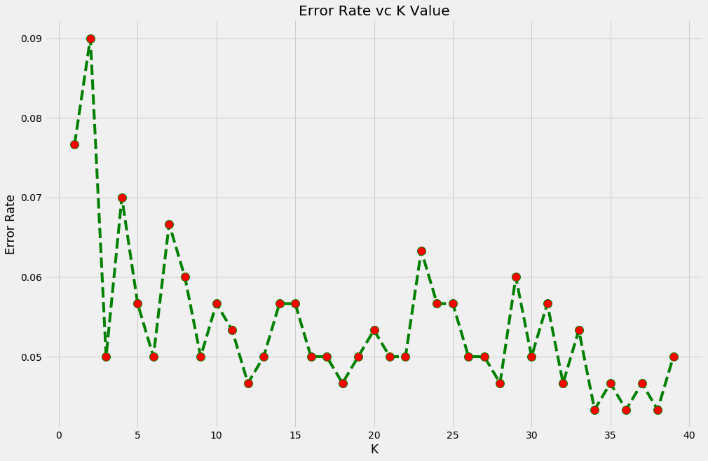

___

# CLASSIFIED DATA
___


___
## Imports section


```python
import numpy as np
import pandas as pd

import matplotlib.pyplot as plt
%matplotlib inline
plt.style.use('fivethirtyeight')
plt.rcParams['figure.figsize'] = (15,5)

import seaborn as sns

from sklearn.cross_validation import train_test_split

from sklearn.preprocessing import StandardScaler

from sklearn.neighbors import KNeighborsClassifier

from sklearn.metrics import confusion_matrix, classification_report

from matplotlib.colors import ListedColormap
```

    C:\ProgramData\Anaconda3\lib\site-packages\sklearn\cross_validation.py:41: DeprecationWarning: This module was deprecated in version 0.18 in favor of the model_selection module into which all the refactored classes and functions are moved. Also note that the interface of the new CV iterators are different from that of this module. This module will be removed in 0.20.
      "This module will be removed in 0.20.", DeprecationWarning)
    

___
## Data Exploring

### Read dataset / Feature Scaling and show head


```python
dataset = pd.read_csv('Classified Data', index_col=0)
scaler = StandardScaler()
scaler =scaler.fit(dataset.drop('TARGET CLASS', axis=1))
scaled_features = scaler.transform(dataset.drop('TARGET CLASS', axis=1))
df_feat = pd.DataFrame(scaled_features, columns=dataset.columns[:-1])
dataset[dataset.columns[:-1]] = df_feat
dataset.head()
```


<div>
<style>
    .dataframe thead tr:only-child th {
        text-align: right;
    }

    .dataframe thead th {
        text-align: left;
    }

    .dataframe tbody tr th {
        vertical-align: top;
    }
</style>
<table border="1" class="dataframe">
  <thead>
    <tr style="text-align: right;">
      <th></th>
      <th>WTT</th>
      <th>PTI</th>
      <th>EQW</th>
      <th>SBI</th>
      <th>LQE</th>
      <th>QWG</th>
      <th>FDJ</th>
      <th>PJF</th>
      <th>HQE</th>
      <th>NXJ</th>
      <th>TARGET CLASS</th>
    </tr>
  </thead>
  <tbody>
    <tr>
      <th>0</th>
      <td>-0.123542</td>
      <td>0.185907</td>
      <td>-0.913431</td>
      <td>0.319629</td>
      <td>-1.033637</td>
      <td>-2.308375</td>
      <td>-0.798951</td>
      <td>-1.482368</td>
      <td>-0.949719</td>
      <td>-0.643314</td>
      <td>1</td>
    </tr>
    <tr>
      <th>1</th>
      <td>-1.084836</td>
      <td>-0.430348</td>
      <td>-1.025313</td>
      <td>0.625388</td>
      <td>-0.444847</td>
      <td>-1.152706</td>
      <td>-1.129797</td>
      <td>-0.202240</td>
      <td>-1.828051</td>
      <td>0.636759</td>
      <td>0</td>
    </tr>
    <tr>
      <th>2</th>
      <td>-0.788702</td>
      <td>0.339318</td>
      <td>0.301511</td>
      <td>0.755873</td>
      <td>2.031693</td>
      <td>-0.870156</td>
      <td>2.599818</td>
      <td>0.285707</td>
      <td>-0.682494</td>
      <td>-0.377850</td>
      <td>0</td>
    </tr>
    <tr>
      <th>3</th>
      <td>0.982841</td>
      <td>1.060193</td>
      <td>-0.621399</td>
      <td>0.625299</td>
      <td>0.452820</td>
      <td>-0.267220</td>
      <td>1.750208</td>
      <td>1.066491</td>
      <td>1.241325</td>
      <td>-1.026987</td>
      <td>1</td>
    </tr>
    <tr>
      <th>4</th>
      <td>1.139275</td>
      <td>-0.640392</td>
      <td>-0.709819</td>
      <td>-0.057175</td>
      <td>0.822886</td>
      <td>-0.936773</td>
      <td>0.596782</td>
      <td>-1.472352</td>
      <td>1.040772</td>
      <td>0.276510</td>
      <td>1</td>
    </tr>
  </tbody>
</table>
</div>


___
## Data Processing

### Separation: X (features) from Y (predict variable)


```python
X = dataset.drop('TARGET CLASS', axis=1)
y = dataset['TARGET CLASS']
```

### Spliting the Data


```python
X_train, X_test, y_train, y_test = train_test_split(X, y, test_size= 0.3, random_state=101)
```

___
## Model Desing

### Creating and training models


```python
classifier = KNeighborsClassifier()
classifier.fit(X_train, y_train)
```


    KNeighborsClassifier(algorithm='auto', leaf_size=30, metric='minkowski',
               metric_params=None, n_jobs=1, n_neighbors=5, p=2,
               weights='uniform')


### Predictions


```python
predictions = classifier.predict(X_test)
```

### Model Performace Analysis


```python
print(classification_report(y_test, predictions))
cm = confusion_matrix(y_true=y_test, y_pred= predictions)
df_cm =pd.DataFrame(data=cm,index=['Real False', 'Real True'], columns=['Pred False', 'Pred True'])
df_cm
```

                 precision    recall  f1-score   support
    
              0       0.93      0.97      0.95       159
              1       0.96      0.91      0.94       141
    
    avg / total       0.94      0.94      0.94       300
    
    


<div>
<style>
    .dataframe thead tr:only-child th {
        text-align: right;
    }

    .dataframe thead th {
        text-align: left;
    }

    .dataframe tbody tr th {
        vertical-align: top;
    }
</style>
<table border="1" class="dataframe">
  <thead>
    <tr style="text-align: right;">
      <th></th>
      <th>Pred False</th>
      <th>Pred True</th>
    </tr>
  </thead>
  <tbody>
    <tr>
      <th>Real False</th>
      <td>154</td>
      <td>5</td>
    </tr>
    <tr>
      <th>Real True</th>
      <td>12</td>
      <td>129</td>
    </tr>
  </tbody>
</table>
</div>


### Selecting the Best K


```python
error_rate = []

for i in range(1,40):
    knn = KNeighborsClassifier(n_neighbors=i)
    knn.fit(X_train, y_train)
    pred_i = knn.predict(X_test)
    error_rate.append(np.mean(pred_i != y_test))
```


```python
plt.figure(figsize=(15,10))
plt.plot(range(1,40), error_rate, color='green', linestyle='--', marker='o', markerfacecolor='red',
        markersize=12)
plt.title('Error Rate vc K Value')
plt.xlabel('K')
plt.ylabel('Error Rate')
```


    Text(0,0.5,'Error Rate')





```python
min_error = min(error_rate)
k = error_rate.index(min_error) + 1
knn = KNeighborsClassifier(n_neighbors=k)
knn.fit(X_train, y_train)
preds = knn.predict(X_test)
```


```python
print(classification_report(y_test, preds))
cm = confusion_matrix(y_true=y_test, y_pred= preds)
df_cm =pd.DataFrame(data=cm,index=['Real False', 'Real True'], columns=['Pred False', 'Pred True'])
df_cm
```

                 precision    recall  f1-score   support
    
              0       0.96      0.96      0.96       159
              1       0.96      0.95      0.95       141
    
    avg / total       0.96      0.96      0.96       300
    
    


<div>
<style>
    .dataframe thead tr:only-child th {
        text-align: right;
    }

    .dataframe thead th {
        text-align: left;
    }

    .dataframe tbody tr th {
        vertical-align: top;
    }
</style>
<table border="1" class="dataframe">
  <thead>
    <tr style="text-align: right;">
      <th></th>
      <th>Pred False</th>
      <th>Pred True</th>
    </tr>
  </thead>
  <tbody>
    <tr>
      <th>Real False</th>
      <td>153</td>
      <td>6</td>
    </tr>
    <tr>
      <th>Real True</th>
      <td>7</td>
      <td>134</td>
    </tr>
  </tbody>
</table>
</div>


