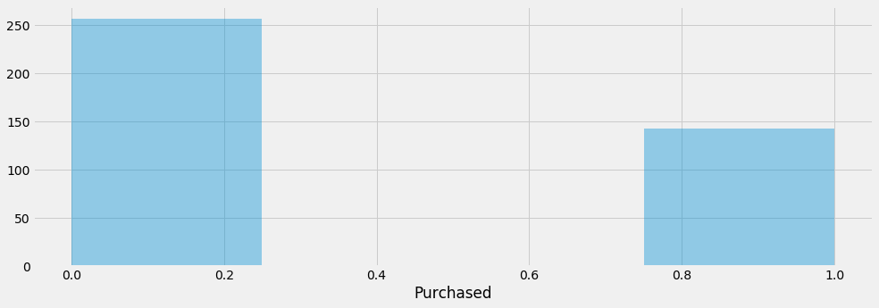
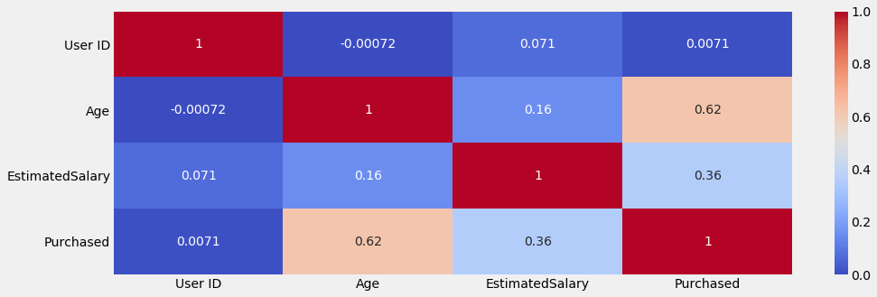
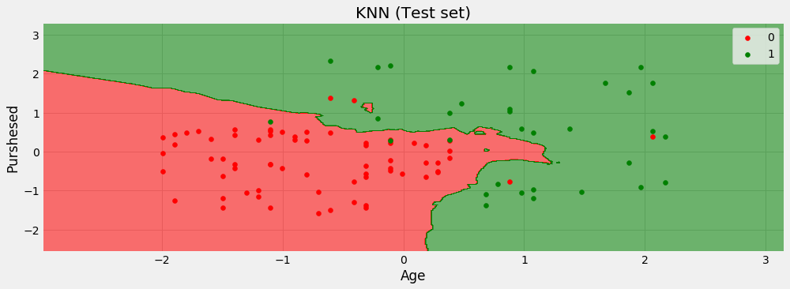

___

# KNN
___


___
## Imports section


```python
import numpy as np
import pandas as pd

import matplotlib.pyplot as plt
%matplotlib inline
plt.style.use('fivethirtyeight')
plt.rcParams['figure.figsize'] = (15,5)

import seaborn as sns

from sklearn.cross_validation import train_test_split

from sklearn.preprocessing import StandardScaler

from sklearn.neighbors import KNeighborsClassifier

from sklearn.metrics import confusion_matrix, classification_report

from matplotlib.colors import ListedColormap
```

___
## Data Exploring

### Read dataset and show head


```python
dataset = pd.read_csv('Social_Network_Ads.csv')
dataset.head()
```


<div>
<style>
    .dataframe thead tr:only-child th {
        text-align: right;
    }

    .dataframe thead th {
        text-align: left;
    }

    .dataframe tbody tr th {
        vertical-align: top;
    }
</style>
<table border="1" class="dataframe">
  <thead>
    <tr style="text-align: right;">
      <th></th>
      <th>User ID</th>
      <th>Gender</th>
      <th>Age</th>
      <th>EstimatedSalary</th>
      <th>Purchased</th>
    </tr>
  </thead>
  <tbody>
    <tr>
      <th>0</th>
      <td>15624510</td>
      <td>Male</td>
      <td>19</td>
      <td>19000</td>
      <td>0</td>
    </tr>
    <tr>
      <th>1</th>
      <td>15810944</td>
      <td>Male</td>
      <td>35</td>
      <td>20000</td>
      <td>0</td>
    </tr>
    <tr>
      <th>2</th>
      <td>15668575</td>
      <td>Female</td>
      <td>26</td>
      <td>43000</td>
      <td>0</td>
    </tr>
    <tr>
      <th>3</th>
      <td>15603246</td>
      <td>Female</td>
      <td>27</td>
      <td>57000</td>
      <td>0</td>
    </tr>
    <tr>
      <th>4</th>
      <td>15804002</td>
      <td>Male</td>
      <td>19</td>
      <td>76000</td>
      <td>0</td>
    </tr>
  </tbody>
</table>
</div>


### Data Info


```python
dataset.info()
```

    <class 'pandas.core.frame.DataFrame'>
    RangeIndex: 400 entries, 0 to 399
    Data columns (total 5 columns):
    User ID            400 non-null int64
    Gender             400 non-null object
    Age                400 non-null int64
    EstimatedSalary    400 non-null int64
    Purchased          400 non-null int64
    dtypes: int64(4), object(1)
    memory usage: 15.7+ KB
    

### Data Describe


```python
dataset.describe()
```


<div>
<style>
    .dataframe thead tr:only-child th {
        text-align: right;
    }

    .dataframe thead th {
        text-align: left;
    }

    .dataframe tbody tr th {
        vertical-align: top;
    }
</style>
<table border="1" class="dataframe">
  <thead>
    <tr style="text-align: right;">
      <th></th>
      <th>User ID</th>
      <th>Age</th>
      <th>EstimatedSalary</th>
      <th>Purchased</th>
    </tr>
  </thead>
  <tbody>
    <tr>
      <th>count</th>
      <td>4.000000e+02</td>
      <td>400.000000</td>
      <td>400.000000</td>
      <td>400.000000</td>
    </tr>
    <tr>
      <th>mean</th>
      <td>1.569154e+07</td>
      <td>37.655000</td>
      <td>69742.500000</td>
      <td>0.357500</td>
    </tr>
    <tr>
      <th>std</th>
      <td>7.165832e+04</td>
      <td>10.482877</td>
      <td>34096.960282</td>
      <td>0.479864</td>
    </tr>
    <tr>
      <th>min</th>
      <td>1.556669e+07</td>
      <td>18.000000</td>
      <td>15000.000000</td>
      <td>0.000000</td>
    </tr>
    <tr>
      <th>25%</th>
      <td>1.562676e+07</td>
      <td>29.750000</td>
      <td>43000.000000</td>
      <td>0.000000</td>
    </tr>
    <tr>
      <th>50%</th>
      <td>1.569434e+07</td>
      <td>37.000000</td>
      <td>70000.000000</td>
      <td>0.000000</td>
    </tr>
    <tr>
      <th>75%</th>
      <td>1.575036e+07</td>
      <td>46.000000</td>
      <td>88000.000000</td>
      <td>1.000000</td>
    </tr>
    <tr>
      <th>max</th>
      <td>1.581524e+07</td>
      <td>60.000000</td>
      <td>150000.000000</td>
      <td>1.000000</td>
    </tr>
  </tbody>
</table>
</div>


### Histogram on Y axis


```python
sns.distplot(dataset['Purchased'],kde=False)
```


    <matplotlib.axes._subplots.AxesSubplot at 0x23b2d87c2e8>





### Correlation


```python
corr = dataset.corr()
corr
```


<div>
<style>
    .dataframe thead tr:only-child th {
        text-align: right;
    }

    .dataframe thead th {
        text-align: left;
    }

    .dataframe tbody tr th {
        vertical-align: top;
    }
</style>
<table border="1" class="dataframe">
  <thead>
    <tr style="text-align: right;">
      <th></th>
      <th>User ID</th>
      <th>Age</th>
      <th>EstimatedSalary</th>
      <th>Purchased</th>
    </tr>
  </thead>
  <tbody>
    <tr>
      <th>User ID</th>
      <td>1.000000</td>
      <td>-0.000721</td>
      <td>0.071097</td>
      <td>0.007120</td>
    </tr>
    <tr>
      <th>Age</th>
      <td>-0.000721</td>
      <td>1.000000</td>
      <td>0.155238</td>
      <td>0.622454</td>
    </tr>
    <tr>
      <th>EstimatedSalary</th>
      <td>0.071097</td>
      <td>0.155238</td>
      <td>1.000000</td>
      <td>0.362083</td>
    </tr>
    <tr>
      <th>Purchased</th>
      <td>0.007120</td>
      <td>0.622454</td>
      <td>0.362083</td>
      <td>1.000000</td>
    </tr>
  </tbody>
</table>
</div>


### Heatmap


```python
sns.heatmap(data=corr,cmap="coolwarm",annot=True)
```


    <matplotlib.axes._subplots.AxesSubplot at 0x23b2da506a0>





___
## Data Processing

### Separation: X (features) from Y (predict variable)


```python
X = dataset.iloc[:,[2,3]].values
y = dataset.iloc[:,4].values
```

### Spliting the Data


```python
X_train, X_test, y_train, y_test = train_test_split(X, y, test_size= 0.25, random_state=0)
```

### Feature Scaling


```python
sc_X = StandardScaler()
X_train = sc_X.fit_transform(X_train)
X_test = sc_X.transform(X_test)
```

    C:\ProgramData\Anaconda3\lib\site-packages\sklearn\utils\validation.py:475: DataConversionWarning: Data with input dtype int64 was converted to float64 by StandardScaler.
      warnings.warn(msg, DataConversionWarning)
    

___
## Model Desing

### Creating and training models


```python
classifier = KNeighborsClassifier()
classifier.fit(X_train, y_train)
```


    KNeighborsClassifier(algorithm='auto', leaf_size=30, metric='minkowski',
               metric_params=None, n_jobs=1, n_neighbors=5, p=2,
               weights='uniform')


### Predictions


```python
predictions = classifier.predict(X_test)
```

### Model Performace Analysis


```python
cm = confusion_matrix(y_true=y_test, y_pred= predictions)
df_cm =pd.DataFrame(data=cm,index=['Real False', 'Real True'], columns=['Pred False', 'Pred True'])
df_cm
```


<div>
<style>
    .dataframe thead tr:only-child th {
        text-align: right;
    }

    .dataframe thead th {
        text-align: left;
    }

    .dataframe tbody tr th {
        vertical-align: top;
    }
</style>
<table border="1" class="dataframe">
  <thead>
    <tr style="text-align: right;">
      <th></th>
      <th>Pred False</th>
      <th>Pred True</th>
    </tr>
  </thead>
  <tbody>
    <tr>
      <th>Real False</th>
      <td>64</td>
      <td>4</td>
    </tr>
    <tr>
      <th>Real True</th>
      <td>3</td>
      <td>29</td>
    </tr>
  </tbody>
</table>
</div>


### Evaluating Model


```python
def plot_logistic_regression(X_set, y_set, title, xlabel, ylabel, classifier):
    X1, X2 = np.meshgrid(np.arange(start = X_set[:, 0].min() - 1, stop = X_set[:, 0].max() + 1, step = 0.01),
                         np.arange(start = X_set[:, 1].min() - 1, stop = X_set[:, 1].max() + 1, step = 0.01))
    plt.contourf(X1, X2, classifier.predict(np.array([X1.ravel(), X2.ravel()]).T).reshape(X1.shape),
                 alpha = 0.55, cmap = ListedColormap(('red', 'green')))
    plt.xlim(X1.min(), X1.max())
    plt.ylim(X2.min(), X2.max())
    for i, j in enumerate(np.unique(y_set)):
        plt.scatter(X_set[y_set == j, 0], X_set[y_set == j, 1],
                    c = ListedColormap(('red', 'green'))(i), label = j)
    plt.title(title)
    plt.xlabel(xlabel)
    plt.ylabel(ylabel)
    plt.legend()
    plt.show()
```


```python
title = 'KNN (Training set)'
xlabel = 'Age'
ylabel = 'Purshesed'
plot_logistic_regression(X_train, y_train, title, xlabel, ylabel, classifier)
```


```python
title = 'KNN (Test set)'
xlabel = 'Age'
ylabel = 'Purshesed'
plot_logistic_regression(X_test, y_test, title, xlabel, ylabel, classifier)
```




