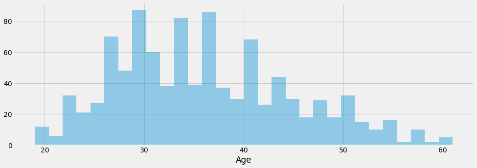
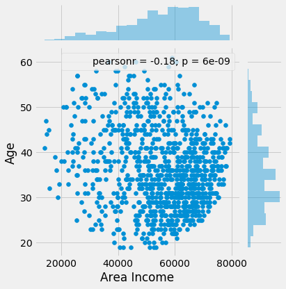
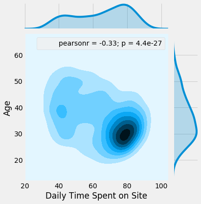
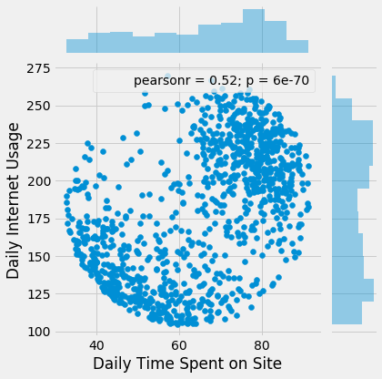
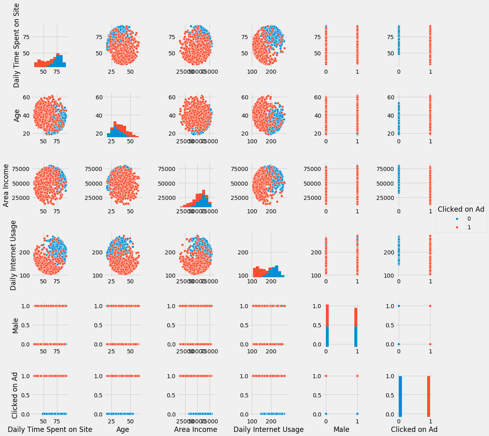
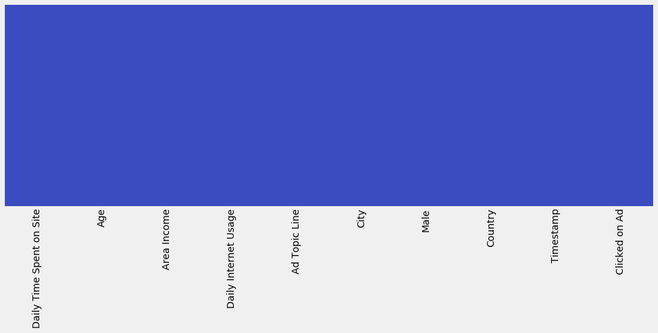

___

___
# Logistic Regression Adverstasing Project 

In this project we will be working with a fake advertising data set, indicating whether or not a particular internet user clicked on an Advertisement. We will try to create a model that will predict whether or not they will click on an ad based off the features of that user.

This data set contains the following features:

* 'Daily Time Spent on Site': consumer time on site in minutes
* 'Age': cutomer age in years
* 'Area Income': Avg. Income of geographical area of consumer
* 'Daily Internet Usage': Avg. minutes a day consumer is on the internet
* 'Ad Topic Line': Headline of the advertisement
* 'City': City of consumer
* 'Male': Whether or not consumer was male
* 'Country': Country of consumer
* 'Timestamp': Time at which consumer clicked on Ad or closed window
* 'Clicked on Ad': 0 or 1 indicated clicking on Ad

## Import Libraries

**Import a few libraries you think you'll need (Or just import them as you go along!)**


```python
import numpy as np
import pandas as pd

import matplotlib.pyplot as plt
%matplotlib inline
plt.style.use('fivethirtyeight')
plt.rcParams['figure.figsize'] = (15,5)

import seaborn as sns
```

## Get the Data
**Read in the advertising.csv file and set it to a data frame called ad_data.**


```python
ad_data = pd.read_csv('advertising.csv')
```

**Check the head of ad_data**


```python
ad_data.head()
```


<div>
<style>
    .dataframe thead tr:only-child th {
        text-align: right;
    }

    .dataframe thead th {
        text-align: left;
    }

    .dataframe tbody tr th {
        vertical-align: top;
    }
</style>
<table border="1" class="dataframe">
  <thead>
    <tr style="text-align: right;">
      <th></th>
      <th>Daily Time Spent on Site</th>
      <th>Age</th>
      <th>Area Income</th>
      <th>Daily Internet Usage</th>
      <th>Ad Topic Line</th>
      <th>City</th>
      <th>Male</th>
      <th>Country</th>
      <th>Timestamp</th>
      <th>Clicked on Ad</th>
    </tr>
  </thead>
  <tbody>
    <tr>
      <th>0</th>
      <td>68.95</td>
      <td>35</td>
      <td>61833.90</td>
      <td>256.09</td>
      <td>Cloned 5thgeneration orchestration</td>
      <td>Wrightburgh</td>
      <td>0</td>
      <td>Tunisia</td>
      <td>2016-03-27 00:53:11</td>
      <td>0</td>
    </tr>
    <tr>
      <th>1</th>
      <td>80.23</td>
      <td>31</td>
      <td>68441.85</td>
      <td>193.77</td>
      <td>Monitored national standardization</td>
      <td>West Jodi</td>
      <td>1</td>
      <td>Nauru</td>
      <td>2016-04-04 01:39:02</td>
      <td>0</td>
    </tr>
    <tr>
      <th>2</th>
      <td>69.47</td>
      <td>26</td>
      <td>59785.94</td>
      <td>236.50</td>
      <td>Organic bottom-line service-desk</td>
      <td>Davidton</td>
      <td>0</td>
      <td>San Marino</td>
      <td>2016-03-13 20:35:42</td>
      <td>0</td>
    </tr>
    <tr>
      <th>3</th>
      <td>74.15</td>
      <td>29</td>
      <td>54806.18</td>
      <td>245.89</td>
      <td>Triple-buffered reciprocal time-frame</td>
      <td>West Terrifurt</td>
      <td>1</td>
      <td>Italy</td>
      <td>2016-01-10 02:31:19</td>
      <td>0</td>
    </tr>
    <tr>
      <th>4</th>
      <td>68.37</td>
      <td>35</td>
      <td>73889.99</td>
      <td>225.58</td>
      <td>Robust logistical utilization</td>
      <td>South Manuel</td>
      <td>0</td>
      <td>Iceland</td>
      <td>2016-06-03 03:36:18</td>
      <td>0</td>
    </tr>
  </tbody>
</table>
</div>


** Use info and describe() on ad_data**


```python
ad_data.info()
```

    <class 'pandas.core.frame.DataFrame'>
    RangeIndex: 1000 entries, 0 to 999
    Data columns (total 10 columns):
    Daily Time Spent on Site    1000 non-null float64
    Age                         1000 non-null int64
    Area Income                 1000 non-null float64
    Daily Internet Usage        1000 non-null float64
    Ad Topic Line               1000 non-null object
    City                        1000 non-null object
    Male                        1000 non-null int64
    Country                     1000 non-null object
    Timestamp                   1000 non-null object
    Clicked on Ad               1000 non-null int64
    dtypes: float64(3), int64(3), object(4)
    memory usage: 78.2+ KB
    


```python
ad_data.describe()
```


<div>
<style>
    .dataframe thead tr:only-child th {
        text-align: right;
    }

    .dataframe thead th {
        text-align: left;
    }

    .dataframe tbody tr th {
        vertical-align: top;
    }
</style>
<table border="1" class="dataframe">
  <thead>
    <tr style="text-align: right;">
      <th></th>
      <th>Daily Time Spent on Site</th>
      <th>Age</th>
      <th>Area Income</th>
      <th>Daily Internet Usage</th>
      <th>Male</th>
      <th>Clicked on Ad</th>
    </tr>
  </thead>
  <tbody>
    <tr>
      <th>count</th>
      <td>1000.000000</td>
      <td>1000.000000</td>
      <td>1000.000000</td>
      <td>1000.000000</td>
      <td>1000.000000</td>
      <td>1000.00000</td>
    </tr>
    <tr>
      <th>mean</th>
      <td>65.000200</td>
      <td>36.009000</td>
      <td>55000.000080</td>
      <td>180.000100</td>
      <td>0.481000</td>
      <td>0.50000</td>
    </tr>
    <tr>
      <th>std</th>
      <td>15.853615</td>
      <td>8.785562</td>
      <td>13414.634022</td>
      <td>43.902339</td>
      <td>0.499889</td>
      <td>0.50025</td>
    </tr>
    <tr>
      <th>min</th>
      <td>32.600000</td>
      <td>19.000000</td>
      <td>13996.500000</td>
      <td>104.780000</td>
      <td>0.000000</td>
      <td>0.00000</td>
    </tr>
    <tr>
      <th>25%</th>
      <td>51.360000</td>
      <td>29.000000</td>
      <td>47031.802500</td>
      <td>138.830000</td>
      <td>0.000000</td>
      <td>0.00000</td>
    </tr>
    <tr>
      <th>50%</th>
      <td>68.215000</td>
      <td>35.000000</td>
      <td>57012.300000</td>
      <td>183.130000</td>
      <td>0.000000</td>
      <td>0.50000</td>
    </tr>
    <tr>
      <th>75%</th>
      <td>78.547500</td>
      <td>42.000000</td>
      <td>65470.635000</td>
      <td>218.792500</td>
      <td>1.000000</td>
      <td>1.00000</td>
    </tr>
    <tr>
      <th>max</th>
      <td>91.430000</td>
      <td>61.000000</td>
      <td>79484.800000</td>
      <td>269.960000</td>
      <td>1.000000</td>
      <td>1.00000</td>
    </tr>
  </tbody>
</table>
</div>


## Exploratory Data Analysis

Let's use seaborn to explore the data!

Try recreating the plots shown below!

** Create a histogram of the Age**


```python
sns.distplot(ad_data['Age'], bins=30, kde=False)
```


    <matplotlib.axes._subplots.AxesSubplot at 0x2bc5209af98>





**Create a jointplot showing Area Income versus Age.**


```python
sns.jointplot(ad_data['Area Income'], ad_data['Age'])
```


    <seaborn.axisgrid.JointGrid at 0x2bc5345f7f0>





**Create a jointplot showing the kde distributions of Daily Time spent on site vs. Age.**


```python
sns.jointplot(ad_data['Daily Time Spent on Site'], ad_data['Age'], kind='kde')
```


    <seaborn.axisgrid.JointGrid at 0x2bc5412a080>





** Create a jointplot of 'Daily Time Spent on Site' vs. 'Daily Internet Usage'**


```python
sns.jointplot(ad_data['Daily Time Spent on Site'], ad_data['Daily Internet Usage'], kind='scatter')
```


    <seaborn.axisgrid.JointGrid at 0x2bc555420f0>





** Finally, create a pairplot with the hue defined by the 'Clicked on Ad' column feature.**


```python
sns.pairplot(data=ad_data, hue='Clicked on Ad')
```


    <seaborn.axisgrid.PairGrid at 0x2bc58aa3898>





# Logistic Regression

Now it's time to do a train test split, and train our model!

You'll have the freedom here to choose columns that you want to train on!

** Split the data into training set and testing set using train_test_split**


```python
sns.heatmap(ad_data.isnull(), yticklabels=False, cbar=False, cmap="coolwarm")
```


    <matplotlib.axes._subplots.AxesSubplot at 0x2bc5bb12160>





```python
X = ad_data[['Daily Time Spent on Site', 'Age','Area Income', 'Daily Internet Usage','Male']]
y = ad_data['Clicked on Ad']
```


```python
from sklearn.cross_validation import train_test_split
```


```python
 X_train, X_test, y_train, y_test = train_test_split(X, y, test_size=0.33, random_state=101)
```

** Train and fit a logistic regression model on the training set.**


```python
from sklearn.linear_model import LogisticRegression
classifier = LogisticRegression()
```


```python
classifier.fit(X_train,y_train)
```


    LogisticRegression(C=1.0, class_weight=None, dual=False, fit_intercept=True,
              intercept_scaling=1, max_iter=100, multi_class='ovr', n_jobs=1,
              penalty='l2', random_state=None, solver='liblinear', tol=0.0001,
              verbose=0, warm_start=False)


## Predictions and Evaluations
** Now predict values for the testing data.**


```python
predictions = classifier.predict(X_test)
```

** Create a classification report for the model.**


```python
from sklearn.metrics import classification_report, confusion_matrix

print(classification_report(y_test, predictions))
cm = confusion_matrix(y_true=y_test, y_pred= predictions)
df_cm =pd.DataFrame(data=cm,index=['Real False', 'Real True'], columns=['Pred False', 'Pred True'])
df_cm
```

                 precision    recall  f1-score   support
    
              0       0.91      0.94      0.92       171
              1       0.93      0.90      0.91       159
    
    avg / total       0.92      0.92      0.92       330
    
    


<div>
<style>
    .dataframe thead tr:only-child th {
        text-align: right;
    }

    .dataframe thead th {
        text-align: left;
    }

    .dataframe tbody tr th {
        vertical-align: top;
    }
</style>
<table border="1" class="dataframe">
  <thead>
    <tr style="text-align: right;">
      <th></th>
      <th>Pred False</th>
      <th>Pred True</th>
    </tr>
  </thead>
  <tbody>
    <tr>
      <th>Real False</th>
      <td>160</td>
      <td>11</td>
    </tr>
    <tr>
      <th>Real True</th>
      <td>16</td>
      <td>143</td>
    </tr>
  </tbody>
</table>
</div>


## Great Job!
