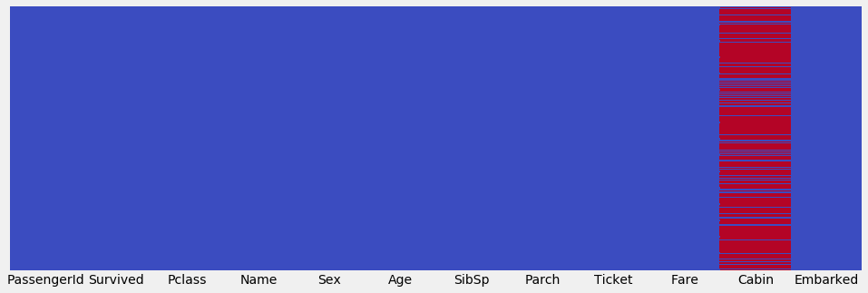

___

# SOLVING TITANIC CHALANGE WITH LOGISTIC REGRESSION
___
## Competition Description
The sinking of the RMS Titanic is one of the most infamous shipwrecks in history.  On April 15, 1912, during her maiden voyage, the Titanic sank after colliding with an iceberg, killing 1502 out of 2224 passengers and crew. This sensational tragedy shocked the international community and led to better safety regulations for ships.
One of the reasons that the shipwreck led to such loss of life was that there were not enough lifeboats for the passengers and crew. Although there was some element of luck involved in surviving the sinking, some groups of people were more likely to survive than others, such as women, children, and the upper-class.
In this challenge, we ask you to complete the analysis of what sorts of people were likely to survive. In particular, we ask you to apply the tools of machine learning to predict which passengers survived the tragedy.

___
## Imports section


```python
import numpy as np
import pandas as pd

import matplotlib.pyplot as plt
%matplotlib inline
plt.style.use('fivethirtyeight')
plt.rcParams['figure.figsize'] = (15,5)

import seaborn as sns

from sklearn.cross_validation import train_test_split

from sklearn.preprocessing import StandardScaler

from sklearn.linear_model import LogisticRegression

from sklearn.metrics import confusion_matrix, classification_report

from matplotlib.colors import ListedColormap
```

___
## Data Exploring

### Read dataset and show head


```python
train_dataset = pd.read_csv('titanic_train.csv')
train_dataset.head()
```


<div>
<style>
    .dataframe thead tr:only-child th {
        text-align: right;
    }

    .dataframe thead th {
        text-align: left;
    }

    .dataframe tbody tr th {
        vertical-align: top;
    }
</style>
<table border="1" class="dataframe">
  <thead>
    <tr style="text-align: right;">
      <th></th>
      <th>PassengerId</th>
      <th>Survived</th>
      <th>Pclass</th>
      <th>Name</th>
      <th>Sex</th>
      <th>Age</th>
      <th>SibSp</th>
      <th>Parch</th>
      <th>Ticket</th>
      <th>Fare</th>
      <th>Cabin</th>
      <th>Embarked</th>
    </tr>
  </thead>
  <tbody>
    <tr>
      <th>0</th>
      <td>1</td>
      <td>0</td>
      <td>3</td>
      <td>Braund, Mr. Owen Harris</td>
      <td>male</td>
      <td>22.0</td>
      <td>1</td>
      <td>0</td>
      <td>A/5 21171</td>
      <td>7.2500</td>
      <td>NaN</td>
      <td>S</td>
    </tr>
    <tr>
      <th>1</th>
      <td>2</td>
      <td>1</td>
      <td>1</td>
      <td>Cumings, Mrs. John Bradley (Florence Briggs Th...</td>
      <td>female</td>
      <td>38.0</td>
      <td>1</td>
      <td>0</td>
      <td>PC 17599</td>
      <td>71.2833</td>
      <td>C85</td>
      <td>C</td>
    </tr>
    <tr>
      <th>2</th>
      <td>3</td>
      <td>1</td>
      <td>3</td>
      <td>Heikkinen, Miss. Laina</td>
      <td>female</td>
      <td>26.0</td>
      <td>0</td>
      <td>0</td>
      <td>STON/O2. 3101282</td>
      <td>7.9250</td>
      <td>NaN</td>
      <td>S</td>
    </tr>
    <tr>
      <th>3</th>
      <td>4</td>
      <td>1</td>
      <td>1</td>
      <td>Futrelle, Mrs. Jacques Heath (Lily May Peel)</td>
      <td>female</td>
      <td>35.0</td>
      <td>1</td>
      <td>0</td>
      <td>113803</td>
      <td>53.1000</td>
      <td>C123</td>
      <td>S</td>
    </tr>
    <tr>
      <th>4</th>
      <td>5</td>
      <td>0</td>
      <td>3</td>
      <td>Allen, Mr. William Henry</td>
      <td>male</td>
      <td>35.0</td>
      <td>0</td>
      <td>0</td>
      <td>373450</td>
      <td>8.0500</td>
      <td>NaN</td>
      <td>S</td>
    </tr>
  </tbody>
</table>
</div>


### Data Info

#### heatmap on missing data


```python
sns.heatmap(train_dataset.isnull(), yticklabels=False, cbar=False, cmap='coolwarm')
```


    <matplotlib.axes._subplots.AxesSubplot at 0x2c14e6f0710>


#### suvivors vs features


```python
sns.countplot(x='Survived', data=train_dataset, hue='Sex', palette= 'RdBu_r')    
```


    <matplotlib.axes._subplots.AxesSubplot at 0x2c14e7a5588>


```python
sns.countplot(x='Survived', data=train_dataset, hue='Pclass' )    
```


    <matplotlib.axes._subplots.AxesSubplot at 0x2c14e700780>


```python
sns.distplot(train_dataset['Age'].dropna(), kde=False, bins=30)
```


    <matplotlib.axes._subplots.AxesSubplot at 0x2c14e6b4080>


```python
sns.countplot(x='SibSp', data= train_dataset)
```


    <matplotlib.axes._subplots.AxesSubplot at 0x2c14ecec240>


```python
train_dataset['Fare'].hist(bins=40)
```


    <matplotlib.axes._subplots.AxesSubplot at 0x2c14e550d30>


```python
plt.figure(figsize=(15,10))
means = train_dataset.groupby(['Pclass'])['Age'].mean().values
mean_labels = [str(np.round(s, 2)) for s in means]
ax = sns.boxplot(x='Pclass', y='Age', data=train_dataset )
pos = range(len(means))
for tick,label in zip(pos, ax.get_xticklabels()):
    ax.text(pos[tick], means[tick] + 0.5, mean_labels[tick], 
            horizontalalignment='center', size='x-small', color='w', weight='semibold')
```


___
## Data Processing

### Dealing with Missing Data


```python
def impute_age(cols):
    means = train_dataset.groupby(['Pclass'])['Age'].mean().values
    age = cols[0]
    pclass = cols[1]
    if (pd.isnull(age)):
        return means[int(pclass)-1]
    return age
```


```python
train_dataset['Age'] = train_dataset[['Age','Pclass']].apply(impute_age, axis=1)
```


```python
sns.heatmap(train_dataset.isnull(), yticklabels=False, cbar=False, cmap='coolwarm')
```


    <matplotlib.axes._subplots.AxesSubplot at 0x2c14c8d0470>





### Encoding Categorical Data


```python
sex_dummies = pd.get_dummies(train_dataset['Sex'], drop_first=True)
embarked_dummies = pd.get_dummies(train_dataset['Embarked'], drop_first=True)
pclass_dumies = pd.get_dummies(train_dataset['Pclass'], drop_first=True)
train_dataset = pd.concat([train_dataset,sex_dummies,embarked_dummies, pclass_dumies], axis=1)
train_dataset.drop(['Sex','Name','Ticket','PassengerId','Pclass', 'Embarked','Cabin','Fare'], axis=1, inplace=True)
train_dataset.dropna(inplace=True, axis=1)
train_dataset.head()
```


<div>
<style>
    .dataframe thead tr:only-child th {
        text-align: right;
    }

    .dataframe thead th {
        text-align: left;
    }

    .dataframe tbody tr th {
        vertical-align: top;
    }
</style>
<table border="1" class="dataframe">
  <thead>
    <tr style="text-align: right;">
      <th></th>
      <th>Survived</th>
      <th>Age</th>
      <th>SibSp</th>
      <th>Parch</th>
      <th>male</th>
      <th>Q</th>
      <th>S</th>
      <th>2</th>
      <th>3</th>
    </tr>
  </thead>
  <tbody>
    <tr>
      <th>0</th>
      <td>0</td>
      <td>22.0</td>
      <td>1</td>
      <td>0</td>
      <td>1</td>
      <td>0</td>
      <td>1</td>
      <td>0</td>
      <td>1</td>
    </tr>
    <tr>
      <th>1</th>
      <td>1</td>
      <td>38.0</td>
      <td>1</td>
      <td>0</td>
      <td>0</td>
      <td>0</td>
      <td>0</td>
      <td>0</td>
      <td>0</td>
    </tr>
    <tr>
      <th>2</th>
      <td>1</td>
      <td>26.0</td>
      <td>0</td>
      <td>0</td>
      <td>0</td>
      <td>0</td>
      <td>1</td>
      <td>0</td>
      <td>1</td>
    </tr>
    <tr>
      <th>3</th>
      <td>1</td>
      <td>35.0</td>
      <td>1</td>
      <td>0</td>
      <td>0</td>
      <td>0</td>
      <td>1</td>
      <td>0</td>
      <td>0</td>
    </tr>
    <tr>
      <th>4</th>
      <td>0</td>
      <td>35.0</td>
      <td>0</td>
      <td>0</td>
      <td>1</td>
      <td>0</td>
      <td>1</td>
      <td>0</td>
      <td>1</td>
    </tr>
  </tbody>
</table>
</div>


### Spliting the Data


```python
X = train_dataset.drop('Survived', axis=1)
y = train_dataset['Survived']
X_train, X_test, y_train, y_test = train_test_split( X, y, test_size=0.30, random_state=101)
```

___
## Model Desing

### Creating and training models


```python
train_classifier = LogisticRegression()
train_classifier.fit(X_train, y_train)

classifier = LogisticRegression()
classifier.fit(X, y)
```


    LogisticRegression(C=1.0, class_weight=None, dual=False, fit_intercept=True,
              intercept_scaling=1, max_iter=100, multi_class='ovr', n_jobs=1,
              penalty='l2', random_state=None, solver='liblinear', tol=0.0001,
              verbose=0, warm_start=False)


### Predictions


```python
train_predictions = train_classifier.predict(X_test)
test_dataset = pd.read_csv('processed_test_dataset.csv')
predictions = classifier.predict(test_dataset)
```

### Model Performace Analysis


```python
print("********* On Train Dataset *********")
print(classification_report(y_test, train_predictions))
cm = confusion_matrix(y_true=y_test, y_pred= train_predictions)
df_cm =pd.DataFrame(data=cm,index=['Real False', 'Real True'], columns=['Pred False', 'Pred True'])
df_cm
```

    ********* On Train Dataset *********
                 precision    recall  f1-score   support
    
              0       0.78      0.90      0.83       154
              1       0.82      0.66      0.73       114
    
    avg / total       0.80      0.79      0.79       268
    
    


<div>
<style>
    .dataframe thead tr:only-child th {
        text-align: right;
    }

    .dataframe thead th {
        text-align: left;
    }

    .dataframe tbody tr th {
        vertical-align: top;
    }
</style>
<table border="1" class="dataframe">
  <thead>
    <tr style="text-align: right;">
      <th></th>
      <th>Pred False</th>
      <th>Pred True</th>
    </tr>
  </thead>
  <tbody>
    <tr>
      <th>Real False</th>
      <td>138</td>
      <td>16</td>
    </tr>
    <tr>
      <th>Real True</th>
      <td>39</td>
      <td>75</td>
    </tr>
  </tbody>
</table>
</div>


### Submission


```python
submission = pd.DataFrame()
submission['PassengerId'] = pd.read_csv('titanic_test.csv')['PassengerId']
submission['Survived'] = predictions
```


```python
submission.to_csv('submission.csv', index=False)
```
