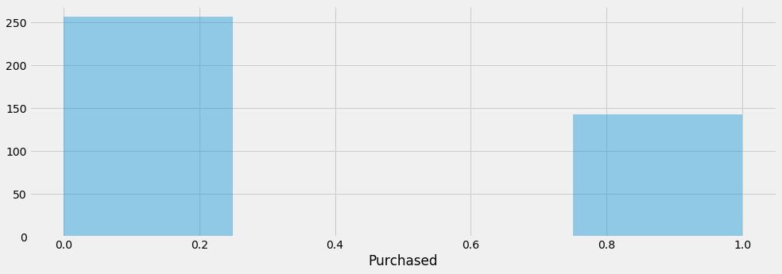
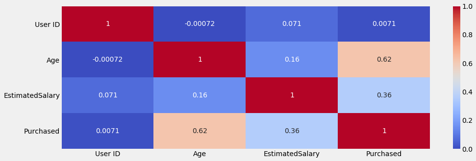
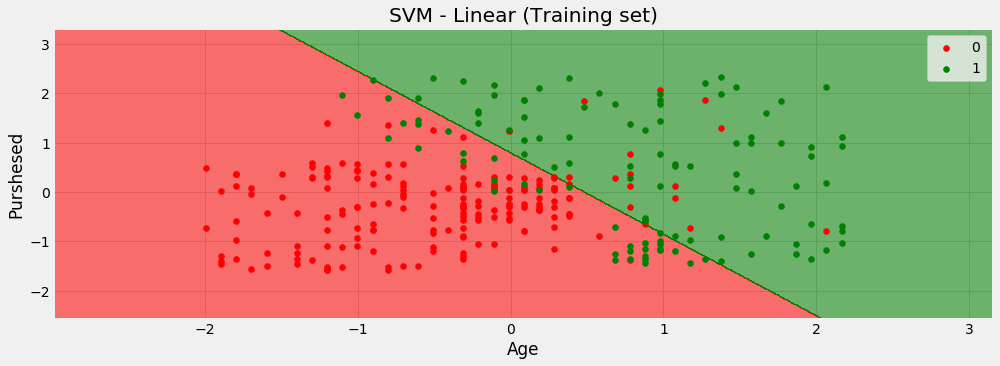
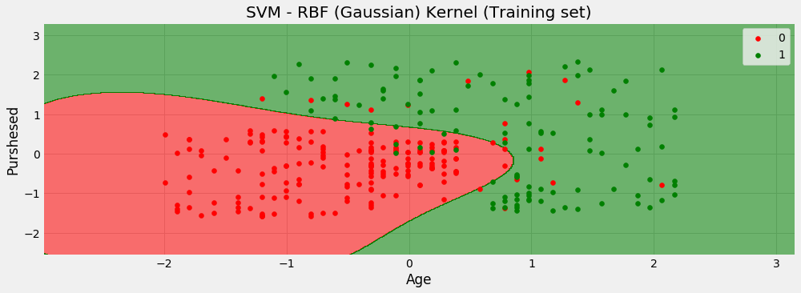
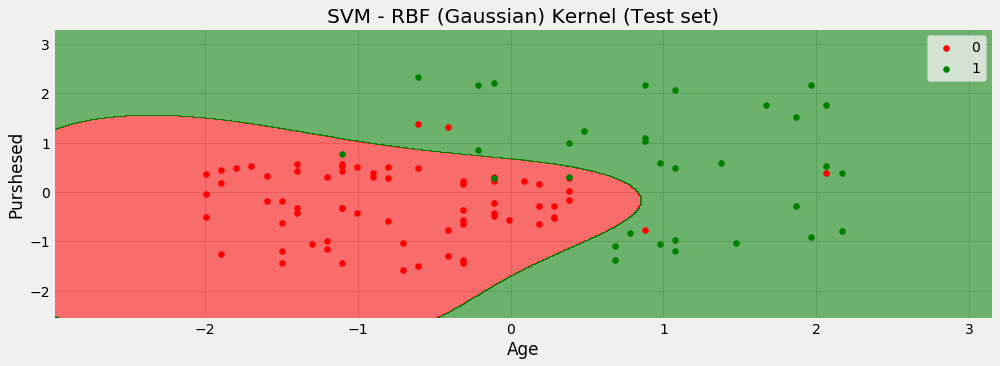

___

# SVM
___


___
## Imports section


```python
import numpy as np
import pandas as pd

import matplotlib.pyplot as plt
%matplotlib inline
plt.style.use('fivethirtyeight')
plt.rcParams['figure.figsize'] = (15,5)

import seaborn as sns

from sklearn.cross_validation import train_test_split

from sklearn.preprocessing import StandardScaler

from sklearn.svm import SVC

from sklearn.metrics import confusion_matrix, classification_report

from matplotlib.colors import ListedColormap
```

    C:\ProgramData\Anaconda3\lib\site-packages\sklearn\cross_validation.py:41: DeprecationWarning: This module was deprecated in version 0.18 in favor of the model_selection module into which all the refactored classes and functions are moved. Also note that the interface of the new CV iterators are different from that of this module. This module will be removed in 0.20.
      "This module will be removed in 0.20.", DeprecationWarning)
    

___
## Data Exploring

### Read dataset and show head


```python
dataset = pd.read_csv('Social_Network_Ads.csv')
dataset.head()
```


<div>
<style>
    .dataframe thead tr:only-child th {
        text-align: right;
    }

    .dataframe thead th {
        text-align: left;
    }

    .dataframe tbody tr th {
        vertical-align: top;
    }
</style>
<table border="1" class="dataframe">
  <thead>
    <tr style="text-align: right;">
      <th></th>
      <th>User ID</th>
      <th>Gender</th>
      <th>Age</th>
      <th>EstimatedSalary</th>
      <th>Purchased</th>
    </tr>
  </thead>
  <tbody>
    <tr>
      <th>0</th>
      <td>15624510</td>
      <td>Male</td>
      <td>19</td>
      <td>19000</td>
      <td>0</td>
    </tr>
    <tr>
      <th>1</th>
      <td>15810944</td>
      <td>Male</td>
      <td>35</td>
      <td>20000</td>
      <td>0</td>
    </tr>
    <tr>
      <th>2</th>
      <td>15668575</td>
      <td>Female</td>
      <td>26</td>
      <td>43000</td>
      <td>0</td>
    </tr>
    <tr>
      <th>3</th>
      <td>15603246</td>
      <td>Female</td>
      <td>27</td>
      <td>57000</td>
      <td>0</td>
    </tr>
    <tr>
      <th>4</th>
      <td>15804002</td>
      <td>Male</td>
      <td>19</td>
      <td>76000</td>
      <td>0</td>
    </tr>
  </tbody>
</table>
</div>


### Data Info


```python
dataset.info()
```

    <class 'pandas.core.frame.DataFrame'>
    RangeIndex: 400 entries, 0 to 399
    Data columns (total 5 columns):
    User ID            400 non-null int64
    Gender             400 non-null object
    Age                400 non-null int64
    EstimatedSalary    400 non-null int64
    Purchased          400 non-null int64
    dtypes: int64(4), object(1)
    memory usage: 15.7+ KB
    

### Data Describe


```python
dataset.describe()
```


<div>
<style>
    .dataframe thead tr:only-child th {
        text-align: right;
    }

    .dataframe thead th {
        text-align: left;
    }

    .dataframe tbody tr th {
        vertical-align: top;
    }
</style>
<table border="1" class="dataframe">
  <thead>
    <tr style="text-align: right;">
      <th></th>
      <th>User ID</th>
      <th>Age</th>
      <th>EstimatedSalary</th>
      <th>Purchased</th>
    </tr>
  </thead>
  <tbody>
    <tr>
      <th>count</th>
      <td>4.000000e+02</td>
      <td>400.000000</td>
      <td>400.000000</td>
      <td>400.000000</td>
    </tr>
    <tr>
      <th>mean</th>
      <td>1.569154e+07</td>
      <td>37.655000</td>
      <td>69742.500000</td>
      <td>0.357500</td>
    </tr>
    <tr>
      <th>std</th>
      <td>7.165832e+04</td>
      <td>10.482877</td>
      <td>34096.960282</td>
      <td>0.479864</td>
    </tr>
    <tr>
      <th>min</th>
      <td>1.556669e+07</td>
      <td>18.000000</td>
      <td>15000.000000</td>
      <td>0.000000</td>
    </tr>
    <tr>
      <th>25%</th>
      <td>1.562676e+07</td>
      <td>29.750000</td>
      <td>43000.000000</td>
      <td>0.000000</td>
    </tr>
    <tr>
      <th>50%</th>
      <td>1.569434e+07</td>
      <td>37.000000</td>
      <td>70000.000000</td>
      <td>0.000000</td>
    </tr>
    <tr>
      <th>75%</th>
      <td>1.575036e+07</td>
      <td>46.000000</td>
      <td>88000.000000</td>
      <td>1.000000</td>
    </tr>
    <tr>
      <th>max</th>
      <td>1.581524e+07</td>
      <td>60.000000</td>
      <td>150000.000000</td>
      <td>1.000000</td>
    </tr>
  </tbody>
</table>
</div>


### Histogram on Y axis


```python
sns.distplot(dataset['Purchased'],kde=False)
```


    <matplotlib.axes._subplots.AxesSubplot at 0x214ce0b4828>





### Correlation


```python
corr = dataset.corr()
corr
```


<div>
<style>
    .dataframe thead tr:only-child th {
        text-align: right;
    }

    .dataframe thead th {
        text-align: left;
    }

    .dataframe tbody tr th {
        vertical-align: top;
    }
</style>
<table border="1" class="dataframe">
  <thead>
    <tr style="text-align: right;">
      <th></th>
      <th>User ID</th>
      <th>Age</th>
      <th>EstimatedSalary</th>
      <th>Purchased</th>
    </tr>
  </thead>
  <tbody>
    <tr>
      <th>User ID</th>
      <td>1.000000</td>
      <td>-0.000721</td>
      <td>0.071097</td>
      <td>0.007120</td>
    </tr>
    <tr>
      <th>Age</th>
      <td>-0.000721</td>
      <td>1.000000</td>
      <td>0.155238</td>
      <td>0.622454</td>
    </tr>
    <tr>
      <th>EstimatedSalary</th>
      <td>0.071097</td>
      <td>0.155238</td>
      <td>1.000000</td>
      <td>0.362083</td>
    </tr>
    <tr>
      <th>Purchased</th>
      <td>0.007120</td>
      <td>0.622454</td>
      <td>0.362083</td>
      <td>1.000000</td>
    </tr>
  </tbody>
</table>
</div>


### Heatmap


```python
sns.heatmap(data=corr,cmap="coolwarm",annot=True)
```


    <matplotlib.axes._subplots.AxesSubplot at 0x214ce0b4ba8>





___
## Data Processing

### Separation: X (features) from Y (predict variable)


```python
X = dataset.iloc[:,[2,3]].values
y = dataset.iloc[:,4].values
```

### Spliting the Data


```python
X_train, X_test, y_train, y_test = train_test_split(X, y, test_size= 0.25, random_state=0)
```

### Feature Scaling


```python
sc_X = StandardScaler()
X_train = sc_X.fit_transform(X_train)
X_test = sc_X.transform(X_test)
```

    C:\ProgramData\Anaconda3\lib\site-packages\sklearn\utils\validation.py:475: DataConversionWarning: Data with input dtype int64 was converted to float64 by StandardScaler.
      warnings.warn(msg, DataConversionWarning)
    

___
## Model Desing

### Creating and training models


```python
classifier= SVC(kernel='linear', random_state=0)
classifier.fit(X_train, y_train)
```


    SVC(C=1.0, cache_size=200, class_weight=None, coef0=0.0,
      decision_function_shape='ovr', degree=3, gamma='auto', kernel='linear',
      max_iter=-1, probability=False, random_state=0, shrinking=True,
      tol=0.001, verbose=False)


### Predictions


```python
predictions = classifier.predict(X_test)
```

### Model Performace Analysis


```python
cm = confusion_matrix(y_true=y_test, y_pred= predictions)
df_cm =pd.DataFrame(data=cm,index=['Real False', 'Real True'], columns=['Pred False', 'Pred True'])
df_cm
```


<div>
<style>
    .dataframe thead tr:only-child th {
        text-align: right;
    }

    .dataframe thead th {
        text-align: left;
    }

    .dataframe tbody tr th {
        vertical-align: top;
    }
</style>
<table border="1" class="dataframe">
  <thead>
    <tr style="text-align: right;">
      <th></th>
      <th>Pred False</th>
      <th>Pred True</th>
    </tr>
  </thead>
  <tbody>
    <tr>
      <th>Real False</th>
      <td>66</td>
      <td>2</td>
    </tr>
    <tr>
      <th>Real True</th>
      <td>8</td>
      <td>24</td>
    </tr>
  </tbody>
</table>
</div>


### Evaluating Model


```python
def plot_classifier(X_set, y_set, title, xlabel, ylabel, classifier):
    X1, X2 = np.meshgrid(np.arange(start = X_set[:, 0].min() - 1, stop = X_set[:, 0].max() + 1, step = 0.01),
                         np.arange(start = X_set[:, 1].min() - 1, stop = X_set[:, 1].max() + 1, step = 0.01))
    plt.contourf(X1, X2, classifier.predict(np.array([X1.ravel(), X2.ravel()]).T).reshape(X1.shape),
                 alpha = 0.55, cmap = ListedColormap(('red', 'green')))
    plt.xlim(X1.min(), X1.max())
    plt.ylim(X2.min(), X2.max())
    for i, j in enumerate(np.unique(y_set)):
        plt.scatter(X_set[y_set == j, 0], X_set[y_set == j, 1],
                    c = ListedColormap(('red', 'green'))(i), label = j)
    plt.title(title)
    plt.xlabel(xlabel)
    plt.ylabel(ylabel)
    plt.legend()
    plt.show()
```


```python
title = 'SVM - Linear Kernel (Training set)'
xlabel = 'Age'
ylabel = 'Purshesed'
plot_classifier(X_train, y_train, title, xlabel, ylabel, classifier)
```





```python
title = 'SVM - Linear Kernel (Test set)'
xlabel = 'Age'
ylabel = 'Purshesed'
plot_classifier(X_test, y_test, title, xlabel, ylabel, classifier)
```


###  Kernel RBF


```python
classifier= SVC(kernel='rbf', random_state=0)
classifier.fit(X_train, y_train)
predictions = classifier.predict(X_test)
cm = confusion_matrix(y_true=y_test, y_pred= predictions)
df_cm =pd.DataFrame(data=cm,index=['Real False', 'Real True'], columns=['Pred False', 'Pred True'])
df_cm
```


<div>
<style>
    .dataframe thead tr:only-child th {
        text-align: right;
    }

    .dataframe thead th {
        text-align: left;
    }

    .dataframe tbody tr th {
        vertical-align: top;
    }
</style>
<table border="1" class="dataframe">
  <thead>
    <tr style="text-align: right;">
      <th></th>
      <th>Pred False</th>
      <th>Pred True</th>
    </tr>
  </thead>
  <tbody>
    <tr>
      <th>Real False</th>
      <td>64</td>
      <td>4</td>
    </tr>
    <tr>
      <th>Real True</th>
      <td>3</td>
      <td>29</td>
    </tr>
  </tbody>
</table>
</div>


```python
title = 'SVM - RBF (Gaussian) Kernel (Training set)'
xlabel = 'Age'
ylabel = 'Purshesed'
plot_classifier(X_train, y_train, title, xlabel, ylabel, classifier)
```





```python
title = 'SVM - RBF (Gaussian) Kernel (Test set)'
xlabel = 'Age'
ylabel = 'Purshesed'
plot_classifier(X_test, y_test, title, xlabel, ylabel, classifier)
```




