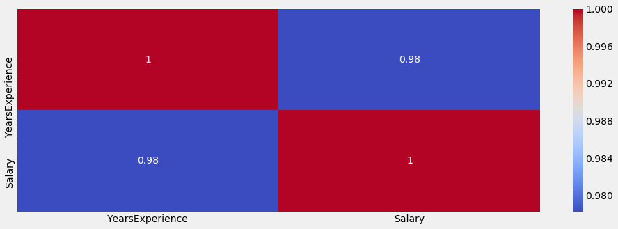
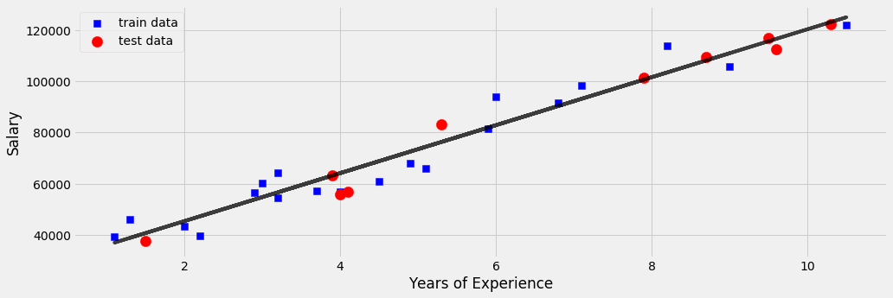

```python
import numpy as np
import matplotlib.pyplot as plt
import pandas as pd

import seaborn as sns
import matplotlib.pyplot as plt

%matplotlib inline
plt.style.use('fivethirtyeight')
plt.rcParams['figure.figsize'] = (15,5)
```


```python
df = pd.read_csv('Salary_Data.csv')
```

## Exploring the Data

#### taking a look at the data


```python
df.head()
```


<div>
<style>
    .dataframe thead tr:only-child th {
        text-align: right;
    }

    .dataframe thead th {
        text-align: left;
    }

    .dataframe tbody tr th {
        vertical-align: top;
    }
</style>
<table border="1" class="dataframe">
  <thead>
    <tr style="text-align: right;">
      <th></th>
      <th>YearsExperience</th>
      <th>Salary</th>
    </tr>
  </thead>
  <tbody>
    <tr>
      <th>0</th>
      <td>1.1</td>
      <td>39343.0</td>
    </tr>
    <tr>
      <th>1</th>
      <td>1.3</td>
      <td>46205.0</td>
    </tr>
    <tr>
      <th>2</th>
      <td>1.5</td>
      <td>37731.0</td>
    </tr>
    <tr>
      <th>3</th>
      <td>2.0</td>
      <td>43525.0</td>
    </tr>
    <tr>
      <th>4</th>
      <td>2.2</td>
      <td>39891.0</td>
    </tr>
  </tbody>
</table>
</div>


#### some description of the data


```python
df.describe()
```


<div>
<style>
    .dataframe thead tr:only-child th {
        text-align: right;
    }

    .dataframe thead th {
        text-align: left;
    }

    .dataframe tbody tr th {
        vertical-align: top;
    }
</style>
<table border="1" class="dataframe">
  <thead>
    <tr style="text-align: right;">
      <th></th>
      <th>YearsExperience</th>
      <th>Salary</th>
    </tr>
  </thead>
  <tbody>
    <tr>
      <th>count</th>
      <td>30.000000</td>
      <td>30.000000</td>
    </tr>
    <tr>
      <th>mean</th>
      <td>5.313333</td>
      <td>76003.000000</td>
    </tr>
    <tr>
      <th>std</th>
      <td>2.837888</td>
      <td>27414.429785</td>
    </tr>
    <tr>
      <th>min</th>
      <td>1.100000</td>
      <td>37731.000000</td>
    </tr>
    <tr>
      <th>25%</th>
      <td>3.200000</td>
      <td>56720.750000</td>
    </tr>
    <tr>
      <th>50%</th>
      <td>4.700000</td>
      <td>65237.000000</td>
    </tr>
    <tr>
      <th>75%</th>
      <td>7.700000</td>
      <td>100544.750000</td>
    </tr>
    <tr>
      <th>max</th>
      <td>10.500000</td>
      <td>122391.000000</td>
    </tr>
  </tbody>
</table>
</div>


#### Correltation between the data


```python
df.corr()
```


<div>
<style>
    .dataframe thead tr:only-child th {
        text-align: right;
    }

    .dataframe thead th {
        text-align: left;
    }

    .dataframe tbody tr th {
        vertical-align: top;
    }
</style>
<table border="1" class="dataframe">
  <thead>
    <tr style="text-align: right;">
      <th></th>
      <th>YearsExperience</th>
      <th>Salary</th>
    </tr>
  </thead>
  <tbody>
    <tr>
      <th>YearsExperience</th>
      <td>1.000000</td>
      <td>0.978242</td>
    </tr>
    <tr>
      <th>Salary</th>
      <td>0.978242</td>
      <td>1.000000</td>
    </tr>
  </tbody>
</table>
</div>


```python
sns.heatmap(df.corr(), cmap='coolwarm', annot=True)
```


    <matplotlib.axes._subplots.AxesSubplot at 0x22ba0c11cc0>





## Pre Processing


```python
X = df['YearsExperience'].values.reshape(-1, 1)
y = df['Salary'].values.reshape(-1, 1)
```

#### Dealing with missing data


```python
# replacing missing data with he mean of the colum
from sklearn.preprocessing import Imputer
imputer = Imputer(missing_values='NaN', strategy='mean', axis=0)
# select the misssing data columns to fit
imputer = imputer.fit(X)
X = imputer.transform(X)
```

## Model and Training


```python
from sklearn.model_selection import train_test_split
```


```python
X_train, X_test, y_train, y_test = train_test_split(X, y, test_size=1/3, random_state=0)
```


```python
from sklearn.linear_model import LinearRegression
model = LinearRegression()
model.fit(X_train, y_train)
```


    LinearRegression(copy_X=True, fit_intercept=True, n_jobs=1, normalize=False)


```python
plt.clf()
plt.plot(X_train, model.predict(X_train), color="black", alpha=0.75)
plt.scatter(X_train, y_train, marker='s', s=70, color="blue", label="train data")
plt.scatter(X_test, y_test, marker='o', s=150, color="red", label="test data")
plt.legend(loc=2)
plt.xlabel("Years of Experience")
plt.ylabel("Salary")
```


    Text(0,0.5,'Salary')





## Predicting/ Slope / Intecept / Score (r^2)


```python
for i,years in enumerate(X) :
    pred = model.predict(years.reshape(-1, 1))[0][0]
    real = y[i][0]
    diff =  real - pred
    percent = real / pred
    print("Predict Salary for " + str(years[0]) + " years of experience is be ${0:.2f}".format(pred) )
    print("Real Salary for " + str(years[0]) + " years of experience is be ${0:.2f}".format(real) )
    print("Difference of ${0:.2f}".format(diff) + " ->  {0:.2f}".format(percent) + " %" )
    print("")

print("Slope: ${0:.2f}".format(model.coef_[0][0]))
print("Intercept: ${0:.2f}".format( model.intercept_[0]))
print("Test Score (r^2): {0:.2f}".format(model.score(X_test, y_test)))
print("Training Score (r^2): {0:.2f}".format(model.score(X_train, y_train)))
print("\n\n\n\n\n\n")
```

    Predict Salary for 1.1 years of experience is be $37096.73
    Real Salary for 1.1 years of experience is be $39343.00
    Difference of $2246.27 ->  1.06 %
    
    Predict Salary for 1.3 years of experience is be $38965.92
    Real Salary for 1.3 years of experience is be $46205.00
    Difference of $7239.08 ->  1.19 %
    
    Predict Salary for 1.5 years of experience is be $40835.11
    Real Salary for 1.5 years of experience is be $37731.00
    Difference of $-3104.11 ->  0.92 %
    
    Predict Salary for 2.0 years of experience is be $45508.08
    Real Salary for 2.0 years of experience is be $43525.00
    Difference of $-1983.08 ->  0.96 %
    
    Predict Salary for 2.2 years of experience is be $47377.27
    Real Salary for 2.2 years of experience is be $39891.00
    Difference of $-7486.27 ->  0.84 %
    
    Predict Salary for 2.9 years of experience is be $53919.43
    Real Salary for 2.9 years of experience is be $56642.00
    Difference of $2722.57 ->  1.05 %
    
    Predict Salary for 3.0 years of experience is be $54854.02
    Real Salary for 3.0 years of experience is be $60150.00
    Difference of $5295.98 ->  1.10 %
    
    Predict Salary for 3.2 years of experience is be $56723.21
    Real Salary for 3.2 years of experience is be $54445.00
    Difference of $-2278.21 ->  0.96 %
    
    Predict Salary for 3.2 years of experience is be $56723.21
    Real Salary for 3.2 years of experience is be $64445.00
    Difference of $7721.79 ->  1.14 %
    
    Predict Salary for 3.7 years of experience is be $61396.18
    Real Salary for 3.7 years of experience is be $57189.00
    Difference of $-4207.18 ->  0.93 %
    
    Predict Salary for 3.9 years of experience is be $63265.37
    Real Salary for 3.9 years of experience is be $63218.00
    Difference of $-47.37 ->  1.00 %
    
    Predict Salary for 4.0 years of experience is be $64199.96
    Real Salary for 4.0 years of experience is be $55794.00
    Difference of $-8405.96 ->  0.87 %
    
    Predict Salary for 4.0 years of experience is be $64199.96
    Real Salary for 4.0 years of experience is be $56957.00
    Difference of $-7242.96 ->  0.89 %
    
    Predict Salary for 4.1 years of experience is be $65134.56
    Real Salary for 4.1 years of experience is be $57081.00
    Difference of $-8053.56 ->  0.88 %
    
    Predict Salary for 4.5 years of experience is be $68872.93
    Real Salary for 4.5 years of experience is be $61111.00
    Difference of $-7761.93 ->  0.89 %
    
    Predict Salary for 4.9 years of experience is be $72611.31
    Real Salary for 4.9 years of experience is be $67938.00
    Difference of $-4673.31 ->  0.94 %
    
    Predict Salary for 5.1 years of experience is be $74480.50
    Real Salary for 5.1 years of experience is be $66029.00
    Difference of $-8451.50 ->  0.89 %
    
    Predict Salary for 5.3 years of experience is be $76349.69
    Real Salary for 5.3 years of experience is be $83088.00
    Difference of $6738.31 ->  1.09 %
    
    Predict Salary for 5.9 years of experience is be $81957.25
    Real Salary for 5.9 years of experience is be $81363.00
    Difference of $-594.25 ->  0.99 %
    
    Predict Salary for 6.0 years of experience is be $82891.85
    Real Salary for 6.0 years of experience is be $93940.00
    Difference of $11048.15 ->  1.13 %
    
    Predict Salary for 6.8 years of experience is be $90368.60
    Real Salary for 6.8 years of experience is be $91738.00
    Difference of $1369.40 ->  1.02 %
    
    Predict Salary for 7.1 years of experience is be $93172.38
    Real Salary for 7.1 years of experience is be $98273.00
    Difference of $5100.62 ->  1.05 %
    
    Predict Salary for 7.9 years of experience is be $100649.14
    Real Salary for 7.9 years of experience is be $101302.00
    Difference of $652.86 ->  1.01 %
    
    Predict Salary for 8.2 years of experience is be $103452.92
    Real Salary for 8.2 years of experience is be $113812.00
    Difference of $10359.08 ->  1.10 %
    
    Predict Salary for 8.7 years of experience is be $108125.89
    Real Salary for 8.7 years of experience is be $109431.00
    Difference of $1305.11 ->  1.01 %
    
    Predict Salary for 9.0 years of experience is be $110929.67
    Real Salary for 9.0 years of experience is be $105582.00
    Difference of $-5347.67 ->  0.95 %
    
    Predict Salary for 9.5 years of experience is be $115602.65
    Real Salary for 9.5 years of experience is be $116969.00
    Difference of $1366.35 ->  1.01 %
    
    Predict Salary for 9.6 years of experience is be $116537.24
    Real Salary for 9.6 years of experience is be $112635.00
    Difference of $-3902.24 ->  0.97 %
    
    Predict Salary for 10.3 years of experience is be $123079.40
    Real Salary for 10.3 years of experience is be $122391.00
    Difference of $-688.40 ->  0.99 %
    
    Predict Salary for 10.5 years of experience is be $124948.59
    Real Salary for 10.5 years of experience is be $121872.00
    Difference of $-3076.59 ->  0.98 %
    
    Slope: $9345.94
    Intercept: $26816.19
    Test Score (r^2): 0.97
    Training Score (r^2): 0.94
    
    
    
    
    
    
    
    
