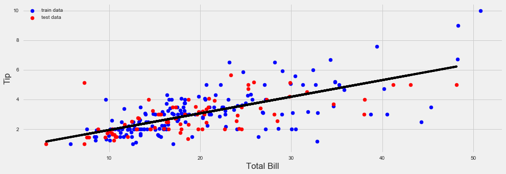

# Linear Regression with Tips Dataset


```python
# imports session
import numpy as np
import pandas as pd
from sklearn.linear_model import LinearRegression
from sklearn.model_selection import train_test_split

# Formatação mais bonita para os notebooks
import seaborn as sns
import matplotlib.pyplot as plt

%matplotlib inline
plt.style.use('fivethirtyeight')
plt.rcParams['figure.figsize'] = (15,5)
```

### Exploring the Dataset


```python
tips = sns.load_dataset('tips')
tips.head()
```


<div>
<style>
    .dataframe thead tr:only-child th {
        text-align: right;
    }

    .dataframe thead th {
        text-align: left;
    }

    .dataframe tbody tr th {
        vertical-align: top;
    }
</style>
<table border="1" class="dataframe">
  <thead>
    <tr style="text-align: right;">
      <th></th>
      <th>total_bill</th>
      <th>tip</th>
      <th>sex</th>
      <th>smoker</th>
      <th>day</th>
      <th>time</th>
      <th>size</th>
    </tr>
  </thead>
  <tbody>
    <tr>
      <th>0</th>
      <td>16.99</td>
      <td>1.01</td>
      <td>Female</td>
      <td>No</td>
      <td>Sun</td>
      <td>Dinner</td>
      <td>2</td>
    </tr>
    <tr>
      <th>1</th>
      <td>10.34</td>
      <td>1.66</td>
      <td>Male</td>
      <td>No</td>
      <td>Sun</td>
      <td>Dinner</td>
      <td>3</td>
    </tr>
    <tr>
      <th>2</th>
      <td>21.01</td>
      <td>3.50</td>
      <td>Male</td>
      <td>No</td>
      <td>Sun</td>
      <td>Dinner</td>
      <td>3</td>
    </tr>
    <tr>
      <th>3</th>
      <td>23.68</td>
      <td>3.31</td>
      <td>Male</td>
      <td>No</td>
      <td>Sun</td>
      <td>Dinner</td>
      <td>2</td>
    </tr>
    <tr>
      <th>4</th>
      <td>24.59</td>
      <td>3.61</td>
      <td>Female</td>
      <td>No</td>
      <td>Sun</td>
      <td>Dinner</td>
      <td>4</td>
    </tr>
  </tbody>
</table>
</div>


```python
tips.describe()
```


<div>
<style>
    .dataframe thead tr:only-child th {
        text-align: right;
    }

    .dataframe thead th {
        text-align: left;
    }

    .dataframe tbody tr th {
        vertical-align: top;
    }
</style>
<table border="1" class="dataframe">
  <thead>
    <tr style="text-align: right;">
      <th></th>
      <th>total_bill</th>
      <th>tip</th>
      <th>size</th>
    </tr>
  </thead>
  <tbody>
    <tr>
      <th>count</th>
      <td>244.000000</td>
      <td>244.000000</td>
      <td>244.000000</td>
    </tr>
    <tr>
      <th>mean</th>
      <td>19.785943</td>
      <td>2.998279</td>
      <td>2.569672</td>
    </tr>
    <tr>
      <th>std</th>
      <td>8.902412</td>
      <td>1.383638</td>
      <td>0.951100</td>
    </tr>
    <tr>
      <th>min</th>
      <td>3.070000</td>
      <td>1.000000</td>
      <td>1.000000</td>
    </tr>
    <tr>
      <th>25%</th>
      <td>13.347500</td>
      <td>2.000000</td>
      <td>2.000000</td>
    </tr>
    <tr>
      <th>50%</th>
      <td>17.795000</td>
      <td>2.900000</td>
      <td>2.000000</td>
    </tr>
    <tr>
      <th>75%</th>
      <td>24.127500</td>
      <td>3.562500</td>
      <td>3.000000</td>
    </tr>
    <tr>
      <th>max</th>
      <td>50.810000</td>
      <td>10.000000</td>
      <td>6.000000</td>
    </tr>
  </tbody>
</table>
</div>


```python
tips.corr()
```


<div>
<style>
    .dataframe thead tr:only-child th {
        text-align: right;
    }

    .dataframe thead th {
        text-align: left;
    }

    .dataframe tbody tr th {
        vertical-align: top;
    }
</style>
<table border="1" class="dataframe">
  <thead>
    <tr style="text-align: right;">
      <th></th>
      <th>total_bill</th>
      <th>tip</th>
      <th>size</th>
    </tr>
  </thead>
  <tbody>
    <tr>
      <th>total_bill</th>
      <td>1.000000</td>
      <td>0.675734</td>
      <td>0.598315</td>
    </tr>
    <tr>
      <th>tip</th>
      <td>0.675734</td>
      <td>1.000000</td>
      <td>0.489299</td>
    </tr>
    <tr>
      <th>size</th>
      <td>0.598315</td>
      <td>0.489299</td>
      <td>1.000000</td>
    </tr>
  </tbody>
</table>
</div>


### Generanting Model and Training


```python
def get_reg(X,y):
    reg = LinearRegression()
    reg.fit(X,y)
    return reg
```


```python
X = tips['total_bill'].values.reshape(-1, 1)
y = tips['tip'].values.reshape(-1, 1)
X_train, X_test, y_train, y_test = train_test_split(X, y, test_size=0.33, random_state=42)
reg = get_reg(X_train, y_train)
```


```python
plt.clf()
plt.scatter(X_train, y_train, color="b", label="train data")
plt.scatter(X_test, y_test, color="r", label="test data")
plt.plot(X_test, reg.predict(X_test), color="black")
plt.legend(loc=2)
plt.xlabel("Total Bill")
plt.ylabel("Tip")
```


    <matplotlib.text.Text at 0x269f67a75f8>





## Predicting/ Slope / Intecept / Score (r^2)


```python
bill = 125.52
predTip = reg.predict([bill])[0][0]
print("Tip for a " + str(bill) + " bill should be " + str(predTip) )
print("Slope: " + str(reg.coef_[0][0]))
print("Intercept: " + str( reg.intercept_[0]))
print("Test Score (r^2): " + str(reg.score(X_test, y_test)))
print("Training Score (r^2): " + str(reg.score(X_train, y_train)))
```

    Tip for a 125.52 bill should be 14.905021202
    Slope: 0.112206997194
    Intercept: 0.820798914257
    Test Score (r^2): 0.399174224346
    Training Score (r^2): 0.464688381508
    

    C:\ProgramData\Anaconda3\lib\site-packages\sklearn\utils\validation.py:395: DeprecationWarning: Passing 1d arrays as data is deprecated in 0.17 and will raise ValueError in 0.19. Reshape your data either using X.reshape(-1, 1) if your data has a single feature or X.reshape(1, -1) if it contains a single sample.
      DeprecationWarning)
    
