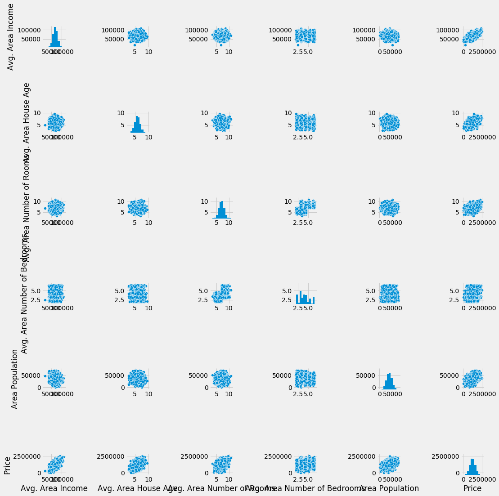
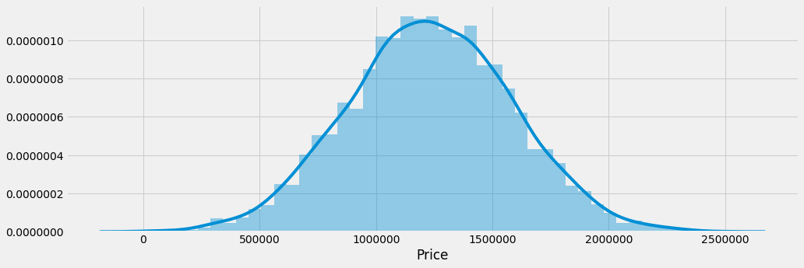
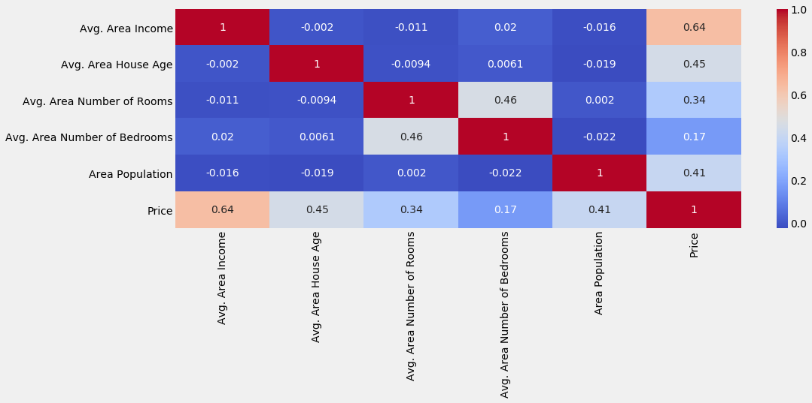
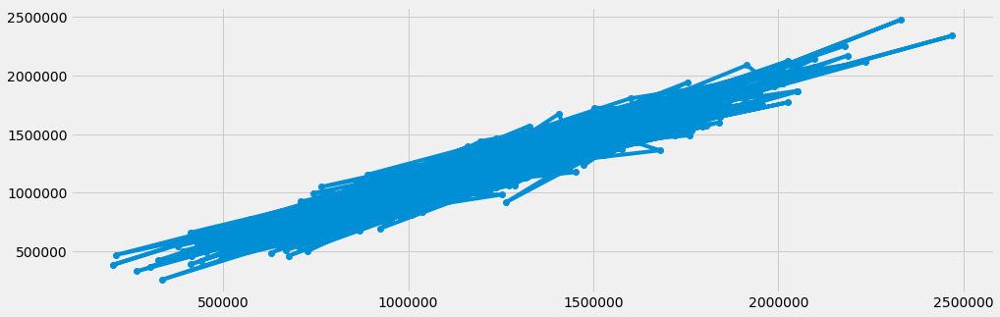
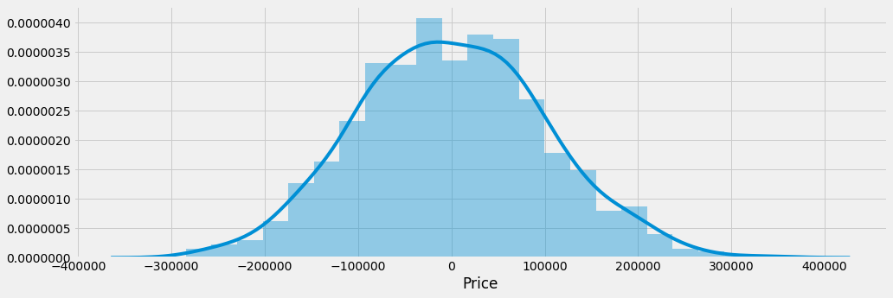

# House Princing with Mocked Data


```python
import numpy as np
import matplotlib.pyplot as plt
import pandas as pd

import seaborn as sns
import matplotlib.pyplot as plt

%matplotlib inline
plt.style.use('fivethirtyeight')
plt.rcParams['figure.figsize'] = (15,5)
```

## Exploring the Data


```python
df = pd.read_csv('USA_Housing.csv')
df.head()
```


<div>
<style>
    .dataframe thead tr:only-child th {
        text-align: right;
    }

    .dataframe thead th {
        text-align: left;
    }

    .dataframe tbody tr th {
        vertical-align: top;
    }
</style>
<table border="1" class="dataframe">
  <thead>
    <tr style="text-align: right;">
      <th></th>
      <th>Avg. Area Income</th>
      <th>Avg. Area House Age</th>
      <th>Avg. Area Number of Rooms</th>
      <th>Avg. Area Number of Bedrooms</th>
      <th>Area Population</th>
      <th>Price</th>
      <th>Address</th>
    </tr>
  </thead>
  <tbody>
    <tr>
      <th>0</th>
      <td>79545.458574</td>
      <td>5.682861</td>
      <td>7.009188</td>
      <td>4.09</td>
      <td>23086.800503</td>
      <td>1.059034e+06</td>
      <td>208 Michael Ferry Apt. 674\nLaurabury, NE 3701...</td>
    </tr>
    <tr>
      <th>1</th>
      <td>79248.642455</td>
      <td>6.002900</td>
      <td>6.730821</td>
      <td>3.09</td>
      <td>40173.072174</td>
      <td>1.505891e+06</td>
      <td>188 Johnson Views Suite 079\nLake Kathleen, CA...</td>
    </tr>
    <tr>
      <th>2</th>
      <td>61287.067179</td>
      <td>5.865890</td>
      <td>8.512727</td>
      <td>5.13</td>
      <td>36882.159400</td>
      <td>1.058988e+06</td>
      <td>9127 Elizabeth Stravenue\nDanieltown, WI 06482...</td>
    </tr>
    <tr>
      <th>3</th>
      <td>63345.240046</td>
      <td>7.188236</td>
      <td>5.586729</td>
      <td>3.26</td>
      <td>34310.242831</td>
      <td>1.260617e+06</td>
      <td>USS Barnett\nFPO AP 44820</td>
    </tr>
    <tr>
      <th>4</th>
      <td>59982.197226</td>
      <td>5.040555</td>
      <td>7.839388</td>
      <td>4.23</td>
      <td>26354.109472</td>
      <td>6.309435e+05</td>
      <td>USNS Raymond\nFPO AE 09386</td>
    </tr>
  </tbody>
</table>
</div>


```python
df.info()
```

    <class 'pandas.core.frame.DataFrame'>
    RangeIndex: 5000 entries, 0 to 4999
    Data columns (total 7 columns):
    Avg. Area Income                5000 non-null float64
    Avg. Area House Age             5000 non-null float64
    Avg. Area Number of Rooms       5000 non-null float64
    Avg. Area Number of Bedrooms    5000 non-null float64
    Area Population                 5000 non-null float64
    Price                           5000 non-null float64
    Address                         5000 non-null object
    dtypes: float64(6), object(1)
    memory usage: 273.5+ KB
    


```python
df.describe()
```


<div>
<style>
    .dataframe thead tr:only-child th {
        text-align: right;
    }

    .dataframe thead th {
        text-align: left;
    }

    .dataframe tbody tr th {
        vertical-align: top;
    }
</style>
<table border="1" class="dataframe">
  <thead>
    <tr style="text-align: right;">
      <th></th>
      <th>Avg. Area Income</th>
      <th>Avg. Area House Age</th>
      <th>Avg. Area Number of Rooms</th>
      <th>Avg. Area Number of Bedrooms</th>
      <th>Area Population</th>
      <th>Price</th>
    </tr>
  </thead>
  <tbody>
    <tr>
      <th>count</th>
      <td>5000.000000</td>
      <td>5000.000000</td>
      <td>5000.000000</td>
      <td>5000.000000</td>
      <td>5000.000000</td>
      <td>5.000000e+03</td>
    </tr>
    <tr>
      <th>mean</th>
      <td>68583.108984</td>
      <td>5.977222</td>
      <td>6.987792</td>
      <td>3.981330</td>
      <td>36163.516039</td>
      <td>1.232073e+06</td>
    </tr>
    <tr>
      <th>std</th>
      <td>10657.991214</td>
      <td>0.991456</td>
      <td>1.005833</td>
      <td>1.234137</td>
      <td>9925.650114</td>
      <td>3.531176e+05</td>
    </tr>
    <tr>
      <th>min</th>
      <td>17796.631190</td>
      <td>2.644304</td>
      <td>3.236194</td>
      <td>2.000000</td>
      <td>172.610686</td>
      <td>1.593866e+04</td>
    </tr>
    <tr>
      <th>25%</th>
      <td>61480.562388</td>
      <td>5.322283</td>
      <td>6.299250</td>
      <td>3.140000</td>
      <td>29403.928702</td>
      <td>9.975771e+05</td>
    </tr>
    <tr>
      <th>50%</th>
      <td>68804.286404</td>
      <td>5.970429</td>
      <td>7.002902</td>
      <td>4.050000</td>
      <td>36199.406689</td>
      <td>1.232669e+06</td>
    </tr>
    <tr>
      <th>75%</th>
      <td>75783.338666</td>
      <td>6.650808</td>
      <td>7.665871</td>
      <td>4.490000</td>
      <td>42861.290769</td>
      <td>1.471210e+06</td>
    </tr>
    <tr>
      <th>max</th>
      <td>107701.748378</td>
      <td>9.519088</td>
      <td>10.759588</td>
      <td>6.500000</td>
      <td>69621.713378</td>
      <td>2.469066e+06</td>
    </tr>
  </tbody>
</table>
</div>


```python
df.columns
```


    Index(['Avg. Area Income', 'Avg. Area House Age', 'Avg. Area Number of Rooms',
           'Avg. Area Number of Bedrooms', 'Area Population', 'Price', 'Address'],
          dtype='object')


```python
sns.pairplot(df)
```


    <seaborn.axisgrid.PairGrid at 0x20233288978>





```python
sns.distplot(df['Price'])
```


    <matplotlib.axes._subplots.AxesSubplot at 0x202327cca20>





```python
sns.heatmap(df.corr(), annot=True,cmap='coolwarm')
```


    <matplotlib.axes._subplots.AxesSubplot at 0x202329cfd68>





## Training the Model


```python
# separating the features from the dependent variable colum
X = df[['Avg. Area Income', 'Avg. Area House Age', 'Avg. Area Number of Rooms',
       'Avg. Area Number of Bedrooms', 'Area Population']]
y = df['Price']
```


```python
from sklearn.cross_validation import train_test_split
```


```python
X_train, X_test, y_train, y_test = train_test_split(X, y, test_size =0.2, random_state = 42)
```


```python
from sklearn.linear_model import LinearRegression
```


```python
model = LinearRegression()
```


```python
model.fit(X_train,y_train)
```


    LinearRegression(copy_X=True, fit_intercept=True, n_jobs=1, normalize=False)


```python
print('Intercept: ' + str(model.intercept_))
```

    Intercept: -2635072.90093
    


```python
df_coef = pd.DataFrame(model.coef_, X.columns, columns=['Coeff'])
df_coef
```


<div>
<style>
    .dataframe thead tr:only-child th {
        text-align: right;
    }

    .dataframe thead th {
        text-align: left;
    }

    .dataframe tbody tr th {
        vertical-align: top;
    }
</style>
<table border="1" class="dataframe">
  <thead>
    <tr style="text-align: right;">
      <th></th>
      <th>Coeff</th>
    </tr>
  </thead>
  <tbody>
    <tr>
      <th>Avg. Area Income</th>
      <td>21.652206</td>
    </tr>
    <tr>
      <th>Avg. Area House Age</th>
      <td>164666.480722</td>
    </tr>
    <tr>
      <th>Avg. Area Number of Rooms</th>
      <td>119624.012232</td>
    </tr>
    <tr>
      <th>Avg. Area Number of Bedrooms</th>
      <td>2440.377611</td>
    </tr>
    <tr>
      <th>Area Population</th>
      <td>15.270313</td>
    </tr>
  </tbody>
</table>
</div>


## Predictions


```python
predictions = model.predict(X_test)
```


```python
plt.plot(y_test,predictions, marker='o')
```


    [<matplotlib.lines.Line2D at 0x20235fab278>]





```python
sns.distplot((y_test-predictions))
plt.title = "Residuals"
```





```python
from sklearn import metrics
```


```python
metrics.mean_absolute_error(y_test,predictions)
```


    80879.097234871748


```python
metrics.mean_squared_error(y_test,predictions)
```


    10089009300.890957


```python
metrics.mean_squared_log_error(y_test,predictions)
```


    0.0098136995987778558


```python
metrics.median_absolute_error(y_test,predictions)
```


    69069.165573360515


