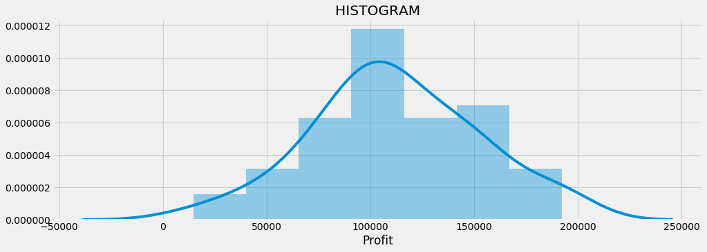
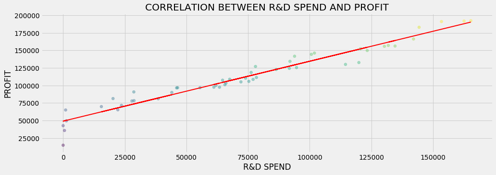
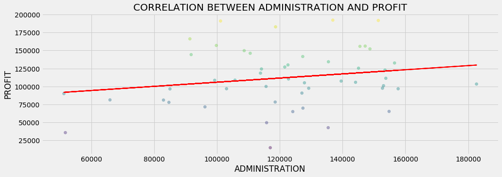
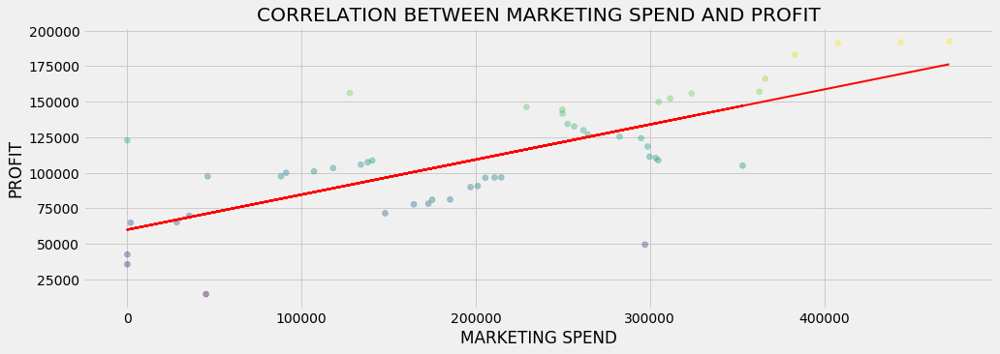
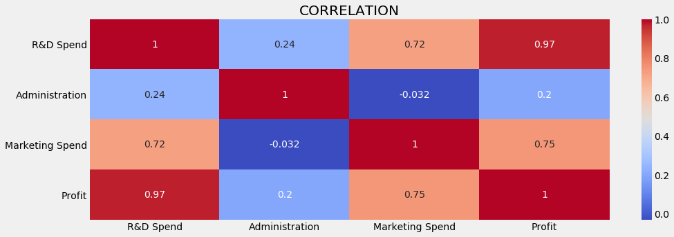
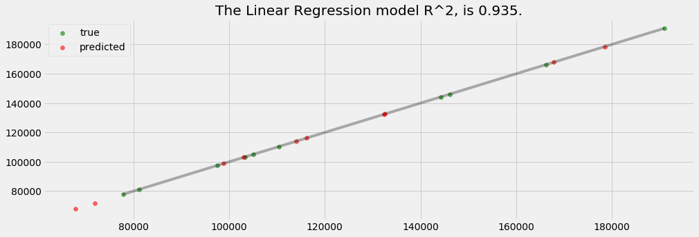

___
# Multiple Linear Regression
___

## Imports


```python
# data analysis
import numpy as np
import matplotlib.pyplot as plt
import pandas as pd

# ploting
import seaborn as sns
import matplotlib.pyplot as plt
%matplotlib inline
plt.style.use('fivethirtyeight')
plt.rcParams['figure.figsize'] = (15,5)

# data preprocesing
from sklearn.preprocessing import Imputer #replace missing data
from sklearn.preprocessing import LabelEncoder, OneHotEncoder #encoding categorical data
from sklearn.preprocessing import StandardScaler #feature scaling

#spliting data
from sklearn.cross_validation import train_test_split

#models
from sklearn.linear_model import LinearRegression

# metrics
from sklearn.metrics import r2_score, mean_absolute_error, mean_squared_error
from math import sqrt
```

    C:\ProgramData\Anaconda3\lib\site-packages\sklearn\cross_validation.py:41: DeprecationWarning: This module was deprecated in version 0.18 in favor of the model_selection module into which all the refactored classes and functions are moved. Also note that the interface of the new CV iterators are different from that of this module. This module will be removed in 0.20.
      "This module will be removed in 0.20.", DeprecationWarning)
    

## Exploring the dataset


```python
dataset = pd.read_csv('50_Startups.csv')
dataset.head()
```


<div>
<style>
    .dataframe thead tr:only-child th {
        text-align: right;
    }

    .dataframe thead th {
        text-align: left;
    }

    .dataframe tbody tr th {
        vertical-align: top;
    }
</style>
<table border="1" class="dataframe">
  <thead>
    <tr style="text-align: right;">
      <th></th>
      <th>R&amp;D Spend</th>
      <th>Administration</th>
      <th>Marketing Spend</th>
      <th>State</th>
      <th>Profit</th>
    </tr>
  </thead>
  <tbody>
    <tr>
      <th>0</th>
      <td>165349.20</td>
      <td>136897.80</td>
      <td>471784.10</td>
      <td>New York</td>
      <td>192261.83</td>
    </tr>
    <tr>
      <th>1</th>
      <td>162597.70</td>
      <td>151377.59</td>
      <td>443898.53</td>
      <td>California</td>
      <td>191792.06</td>
    </tr>
    <tr>
      <th>2</th>
      <td>153441.51</td>
      <td>101145.55</td>
      <td>407934.54</td>
      <td>Florida</td>
      <td>191050.39</td>
    </tr>
    <tr>
      <th>3</th>
      <td>144372.41</td>
      <td>118671.85</td>
      <td>383199.62</td>
      <td>New York</td>
      <td>182901.99</td>
    </tr>
    <tr>
      <th>4</th>
      <td>142107.34</td>
      <td>91391.77</td>
      <td>366168.42</td>
      <td>Florida</td>
      <td>166187.94</td>
    </tr>
  </tbody>
</table>
</div>


```python
dataset.info()
```

    <class 'pandas.core.frame.DataFrame'>
    RangeIndex: 50 entries, 0 to 49
    Data columns (total 5 columns):
    R&D Spend          50 non-null float64
    Administration     50 non-null float64
    Marketing Spend    50 non-null float64
    State              50 non-null object
    Profit             50 non-null float64
    dtypes: float64(4), object(1)
    memory usage: 2.0+ KB
    


```python
dataset.describe()
```


<div>
<style>
    .dataframe thead tr:only-child th {
        text-align: right;
    }

    .dataframe thead th {
        text-align: left;
    }

    .dataframe tbody tr th {
        vertical-align: top;
    }
</style>
<table border="1" class="dataframe">
  <thead>
    <tr style="text-align: right;">
      <th></th>
      <th>R&amp;D Spend</th>
      <th>Administration</th>
      <th>Marketing Spend</th>
      <th>Profit</th>
    </tr>
  </thead>
  <tbody>
    <tr>
      <th>count</th>
      <td>50.000000</td>
      <td>50.000000</td>
      <td>50.000000</td>
      <td>50.000000</td>
    </tr>
    <tr>
      <th>mean</th>
      <td>73721.615600</td>
      <td>121344.639600</td>
      <td>211025.097800</td>
      <td>112012.639200</td>
    </tr>
    <tr>
      <th>std</th>
      <td>45902.256482</td>
      <td>28017.802755</td>
      <td>122290.310726</td>
      <td>40306.180338</td>
    </tr>
    <tr>
      <th>min</th>
      <td>0.000000</td>
      <td>51283.140000</td>
      <td>0.000000</td>
      <td>14681.400000</td>
    </tr>
    <tr>
      <th>25%</th>
      <td>39936.370000</td>
      <td>103730.875000</td>
      <td>129300.132500</td>
      <td>90138.902500</td>
    </tr>
    <tr>
      <th>50%</th>
      <td>73051.080000</td>
      <td>122699.795000</td>
      <td>212716.240000</td>
      <td>107978.190000</td>
    </tr>
    <tr>
      <th>75%</th>
      <td>101602.800000</td>
      <td>144842.180000</td>
      <td>299469.085000</td>
      <td>139765.977500</td>
    </tr>
    <tr>
      <th>max</th>
      <td>165349.200000</td>
      <td>182645.560000</td>
      <td>471784.100000</td>
      <td>192261.830000</td>
    </tr>
  </tbody>
</table>
</div>


```python
    sns.distplot(dataset['Profit'])
    plt.title("HISTOGRAM")
```


    Text(0.5,1,'HISTOGRAM')





```python
def show_corr(data, ylabel):
    for columnName in data.columns.values.tolist():
        column = data[columnName]
        if column.dtype == "object" or columnName == ylabel:
            continue
        column = column.reshape(-1,1)
        xlabel = columnName.upper()
        y = data[ylabel]
        model = LinearRegression()
        model.fit(column, y)
        predictions =  model.predict(column)
        plt.plot(column, predictions, color='red', linewidth=2)
        plt.scatter(column, y, alpha=0.4, c=y)
        plt.xlabel(xlabel)
        plt.ylabel(ylabel.upper())
        plt.title("CORRELATION BETWEEN " + xlabel + " AND " + ylabel.upper())
        plt.show()

show_corr(dataset,"Profit")

dataset.corr()
```

    C:\ProgramData\Anaconda3\lib\site-packages\ipykernel_launcher.py:6: FutureWarning: reshape is deprecated and will raise in a subsequent release. Please use .values.reshape(...) instead
      
    











<div>
<style>
    .dataframe thead tr:only-child th {
        text-align: right;
    }

    .dataframe thead th {
        text-align: left;
    }

    .dataframe tbody tr th {
        vertical-align: top;
    }
</style>
<table border="1" class="dataframe">
  <thead>
    <tr style="text-align: right;">
      <th></th>
      <th>R&amp;D Spend</th>
      <th>Administration</th>
      <th>Marketing Spend</th>
      <th>Profit</th>
    </tr>
  </thead>
  <tbody>
    <tr>
      <th>R&amp;D Spend</th>
      <td>1.000000</td>
      <td>0.241955</td>
      <td>0.724248</td>
      <td>0.972900</td>
    </tr>
    <tr>
      <th>Administration</th>
      <td>0.241955</td>
      <td>1.000000</td>
      <td>-0.032154</td>
      <td>0.200717</td>
    </tr>
    <tr>
      <th>Marketing Spend</th>
      <td>0.724248</td>
      <td>-0.032154</td>
      <td>1.000000</td>
      <td>0.747766</td>
    </tr>
    <tr>
      <th>Profit</th>
      <td>0.972900</td>
      <td>0.200717</td>
      <td>0.747766</td>
      <td>1.000000</td>
    </tr>
  </tbody>
</table>
</div>


```python
sns.heatmap(data=dataset.corr(),cmap="coolwarm",annot=True)
plt.title("CORRELATION")
```


    Text(0.5,1,'CORRELATION')





## Data Processing


```python
X = dataset.iloc[:, :-1].values
y = dataset.iloc[:, 4].values
```

### Encoding Categorial Data


```python
enconder_X = LabelEncoder()
X[:,3] = enconder_X.fit_transform(X[:,3])
onehot_encoder_x = OneHotEncoder(categorical_features=[3])
X = onehot_encoder_x.fit_transform(X).toarray()
pd.DataFrame(data=X, columns=['California','Florida','New York','R&D Spend','Administration','MKT Spend']).head()
```


<div>
<style>
    .dataframe thead tr:only-child th {
        text-align: right;
    }

    .dataframe thead th {
        text-align: left;
    }

    .dataframe tbody tr th {
        vertical-align: top;
    }
</style>
<table border="1" class="dataframe">
  <thead>
    <tr style="text-align: right;">
      <th></th>
      <th>California</th>
      <th>Florida</th>
      <th>New York</th>
      <th>R&amp;D Spend</th>
      <th>Administration</th>
      <th>MKT Spend</th>
    </tr>
  </thead>
  <tbody>
    <tr>
      <th>0</th>
      <td>0.0</td>
      <td>0.0</td>
      <td>1.0</td>
      <td>165349.20</td>
      <td>136897.80</td>
      <td>471784.10</td>
    </tr>
    <tr>
      <th>1</th>
      <td>1.0</td>
      <td>0.0</td>
      <td>0.0</td>
      <td>162597.70</td>
      <td>151377.59</td>
      <td>443898.53</td>
    </tr>
    <tr>
      <th>2</th>
      <td>0.0</td>
      <td>1.0</td>
      <td>0.0</td>
      <td>153441.51</td>
      <td>101145.55</td>
      <td>407934.54</td>
    </tr>
    <tr>
      <th>3</th>
      <td>0.0</td>
      <td>0.0</td>
      <td>1.0</td>
      <td>144372.41</td>
      <td>118671.85</td>
      <td>383199.62</td>
    </tr>
    <tr>
      <th>4</th>
      <td>0.0</td>
      <td>1.0</td>
      <td>0.0</td>
      <td>142107.34</td>
      <td>91391.77</td>
      <td>366168.42</td>
    </tr>
  </tbody>
</table>
</div>


### Avoiding the Dymmy Variable Trap


```python
X = X[:,1:] #removing the 1st column
```

### Splitting the dataset into the Training set and Test set


```python
from sklearn.cross_validation import train_test_split
X_train, X_test, y_train, y_test = train_test_split(X, y, test_size = 0.2, random_state = 0)
```

## Creating and Training the model


```python
linear_regressor = LinearRegression()
linear_regressor.fit(X_train, y_train)
```


    LinearRegression(copy_X=True, fit_intercept=True, n_jobs=1, normalize=False)


## Predictions


```python
linear_regressor_predictions = linear_regressor.predict(X_test)
```

## Performace


```python
def performance_metric(y_true, y_predict):
    score = r2_score(y_true, y_predict)
    return score

def plot_performance_metrics(y_true, y_predict, model_name):
    #ploting the values
    true_handle = plt.scatter(y_true, y_true, alpha=0.6, color='green', label='true')
    #reference line
    fit = np.poly1d(np.polyfit(y_true,y_true,1))
    lims = np.linspace(min(y_true) - 1, max(y_true) + 1)
    plt.plot(lims, fit(lims), alpha= 0.3, color='black')
    # plot predic valus
    pred_handle =  plt.scatter(y_true, y_predict, alpha=0.6, color='red', label='predicted')
    # legend and show
    plt.legend(handles=[true_handle, pred_handle], loc='upper left')
    score = performance_metric(y_true, y_predict)
    print ("\nThe " + model_name +" model R^2, is {:.3f}.".format(score))
    plt.title("The " + model_name +" model R^2, is {:.3f}.".format(score))
    plt.show()
```


```python
plot_performance_metrics(y_test, linear_regressor_predictions, "Linear Regression")
```

    
    The Linear Regression model R^2, is 0.935.
    





## Evaluating Model


```python
r2 = r2_score(y_test, linear_regressor_predictions)
mean_absolute_error = mean_absolute_error(y_test,linear_regressor_predictions)
mean_squared_error = mean_squared_error(y_test,linear_regressor_predictions)
root_mean_squared_error = sqrt(mean_squared_error)
print("R^2  : " + str(r2))
print("MAE  : " + str(mean_absolute_error))
print("MSE  : " + str(mean_squared_error))
print("RMSE : " + str(root_mean_squared_error))
```

    R^2  : 0.934706847328
    MAE  : 7514.29365964
    MSE  : 83502864.0326
    RMSE : 9137.990152795797
    
