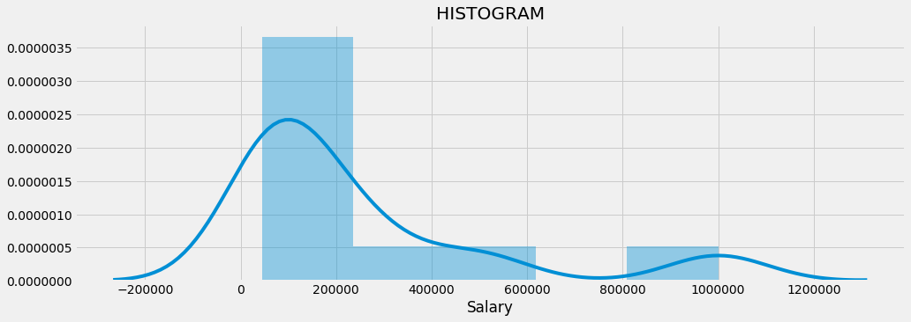

___
# Polynomial Regression
___

## Imports


```python
# data analysis
import numpy as np
import matplotlib.pyplot as plt
import pandas as pd

# ploting
import seaborn as sns
import matplotlib.pyplot as plt
%matplotlib inline
plt.style.use('fivethirtyeight')
plt.rcParams['figure.figsize'] = (15,5)

# data preprocesing
from sklearn.preprocessing import Imputer #replace missing data
from sklearn.preprocessing import LabelEncoder, OneHotEncoder #encoding categorical data
from sklearn.preprocessing import StandardScaler #feature scaling

#spliting data
from sklearn.cross_validation import train_test_split

# models
from sklearn.linear_model import LinearRegression
from sklearn.preprocessing import PolynomialFeatures
# backward elimitnation
import statsmodels.formula.api as sm
from statsmodels.regression.linear_model import OLSResults

# metrics
from sklearn.metrics import r2_score, mean_absolute_error, mean_squared_error
from math import sqrt
```

## Exploring the dataset


```python
dataset = pd.read_csv('Position_Salaries.csv')
dataset.head()
```


<div>
<style>
    .dataframe thead tr:only-child th {
        text-align: right;
    }

    .dataframe thead th {
        text-align: left;
    }

    .dataframe tbody tr th {
        vertical-align: top;
    }
</style>
<table border="1" class="dataframe">
  <thead>
    <tr style="text-align: right;">
      <th></th>
      <th>Position</th>
      <th>Level</th>
      <th>Salary</th>
    </tr>
  </thead>
  <tbody>
    <tr>
      <th>0</th>
      <td>Business Analyst</td>
      <td>1</td>
      <td>45000</td>
    </tr>
    <tr>
      <th>1</th>
      <td>Junior Consultant</td>
      <td>2</td>
      <td>50000</td>
    </tr>
    <tr>
      <th>2</th>
      <td>Senior Consultant</td>
      <td>3</td>
      <td>60000</td>
    </tr>
    <tr>
      <th>3</th>
      <td>Manager</td>
      <td>4</td>
      <td>80000</td>
    </tr>
    <tr>
      <th>4</th>
      <td>Country Manager</td>
      <td>5</td>
      <td>110000</td>
    </tr>
  </tbody>
</table>
</div>


```python
dataset.info()
```

    <class 'pandas.core.frame.DataFrame'>
    RangeIndex: 10 entries, 0 to 9
    Data columns (total 3 columns):
    Position    10 non-null object
    Level       10 non-null int64
    Salary      10 non-null int64
    dtypes: int64(2), object(1)
    memory usage: 320.0+ bytes
    


```python
dataset.describe()
```


<div>
<style>
    .dataframe thead tr:only-child th {
        text-align: right;
    }

    .dataframe thead th {
        text-align: left;
    }

    .dataframe tbody tr th {
        vertical-align: top;
    }
</style>
<table border="1" class="dataframe">
  <thead>
    <tr style="text-align: right;">
      <th></th>
      <th>Level</th>
      <th>Salary</th>
    </tr>
  </thead>
  <tbody>
    <tr>
      <th>count</th>
      <td>10.00000</td>
      <td>10.000000</td>
    </tr>
    <tr>
      <th>mean</th>
      <td>5.50000</td>
      <td>249500.000000</td>
    </tr>
    <tr>
      <th>std</th>
      <td>3.02765</td>
      <td>299373.883668</td>
    </tr>
    <tr>
      <th>min</th>
      <td>1.00000</td>
      <td>45000.000000</td>
    </tr>
    <tr>
      <th>25%</th>
      <td>3.25000</td>
      <td>65000.000000</td>
    </tr>
    <tr>
      <th>50%</th>
      <td>5.50000</td>
      <td>130000.000000</td>
    </tr>
    <tr>
      <th>75%</th>
      <td>7.75000</td>
      <td>275000.000000</td>
    </tr>
    <tr>
      <th>max</th>
      <td>10.00000</td>
      <td>1000000.000000</td>
    </tr>
  </tbody>
</table>
</div>


```python
sns.distplot(dataset['Salary'])
plt.title("HISTOGRAM")
```


    Text(0.5,1,'HISTOGRAM')





```python
def show_corr(data, ylabel):
    for columnName in data.columns.values.tolist():
        column = data[columnName]
        if column.dtype == "object" or columnName == ylabel:
            continue
        column = column.reshape(-1,1)
        xlabel = columnName.upper()
        y = data[ylabel]
        model = LinearRegression()
        model.fit(column, y)
        predictions =  model.predict(column)
        plt.plot(column, predictions, color='red', linewidth=2)
        plt.scatter(column, y, alpha=0.4, c=y)
        plt.xlabel(xlabel)
        plt.ylabel(ylabel.upper())
        plt.title("CORRELATION BETWEEN " + xlabel + " AND " + ylabel.upper())
        plt.show()

show_corr(dataset,"Salary")

dataset.corr()
```

    C:\ProgramData\Anaconda3\lib\site-packages\ipykernel_launcher.py:6: FutureWarning: reshape is deprecated and will raise in a subsequent release. Please use .values.reshape(...) instead
      
    


<div>
<style>
    .dataframe thead tr:only-child th {
        text-align: right;
    }

    .dataframe thead th {
        text-align: left;
    }

    .dataframe tbody tr th {
        vertical-align: top;
    }
</style>
<table border="1" class="dataframe">
  <thead>
    <tr style="text-align: right;">
      <th></th>
      <th>Level</th>
      <th>Salary</th>
    </tr>
  </thead>
  <tbody>
    <tr>
      <th>Level</th>
      <td>1.000000</td>
      <td>0.817949</td>
    </tr>
    <tr>
      <th>Salary</th>
      <td>0.817949</td>
      <td>1.000000</td>
    </tr>
  </tbody>
</table>
</div>


```python
sns.heatmap(data=dataset.corr(),cmap="coolwarm",annot=True)
plt.title("CORRELATION")
```


    Text(0.5,1,'CORRELATION')


## Data Processing


```python
X = dataset.iloc[:, 1:2].values
y = dataset.iloc[:, 2].values
```

### Splitting the dataset into the Training set and Test set


```python
#dataset in this case is to small
#X_train, X_test, y_train, y_test = train_test_split(X, y, test_size = 0.2, random_state = 0)
```

## Creating and Training the model


```python
linear_regressor = LinearRegression()
linear_regressor.fit(X, y)
```


    LinearRegression(copy_X=True, fit_intercept=True, n_jobs=1, normalize=False)


```python
poly_features = PolynomialFeatures(degree=4)
X_poly = poly_features.fit_transform(X)
X_poly
```


    array([[  1.00000000e+00,   1.00000000e+00,   1.00000000e+00,
              1.00000000e+00,   1.00000000e+00],
           [  1.00000000e+00,   2.00000000e+00,   4.00000000e+00,
              8.00000000e+00,   1.60000000e+01],
           [  1.00000000e+00,   3.00000000e+00,   9.00000000e+00,
              2.70000000e+01,   8.10000000e+01],
           [  1.00000000e+00,   4.00000000e+00,   1.60000000e+01,
              6.40000000e+01,   2.56000000e+02],
           [  1.00000000e+00,   5.00000000e+00,   2.50000000e+01,
              1.25000000e+02,   6.25000000e+02],
           [  1.00000000e+00,   6.00000000e+00,   3.60000000e+01,
              2.16000000e+02,   1.29600000e+03],
           [  1.00000000e+00,   7.00000000e+00,   4.90000000e+01,
              3.43000000e+02,   2.40100000e+03],
           [  1.00000000e+00,   8.00000000e+00,   6.40000000e+01,
              5.12000000e+02,   4.09600000e+03],
           [  1.00000000e+00,   9.00000000e+00,   8.10000000e+01,
              7.29000000e+02,   6.56100000e+03],
           [  1.00000000e+00,   1.00000000e+01,   1.00000000e+02,
              1.00000000e+03,   1.00000000e+04]])


```python
poly_regressor = LinearRegression()
poly_regressor.fit(X_poly,y)
```


    LinearRegression(copy_X=True, fit_intercept=True, n_jobs=1, normalize=False)


## Predictions


```python
linear_regressor_predictions = linear_regressor.predict(X)
poly_regressor_predictions = poly_regressor.predict(poly_features.fit_transform(X))
```

## Perfomance


```python
def performance_metric(y_true, y_predict):
    score = r2_score(y_true, y_predict)
    return score

def plot_performance_metrics(X, y_true, y_predict, model_name):
    plt.scatter(X,y_true, color='r')
    plt.plot(X, y_predict, color='b')
    
    plt.xlabel("Position Level")
    plt.ylabel("Salary")
    score = performance_metric(y_true, y_predict)
    print ("\nThe " + model_name +" model R^2, is {:.3f}.".format(score))
    plt.title("The " + model_name +" model R^2, is {:.3f}.".format(score))
    plt.show()
    
def plot_performance_metrics_poly(X,y, poly_regressor, poly_features, model_name):
    X_grid = np.arange(min(X), max(X), 0.1)
    X_grid = X_grid.reshape((len(X_grid), 1))
    plt.scatter(X, y, color = 'red')
    y_predict = poly_regressor.predict(poly_features.fit_transform(X_grid))
    plt.plot(X_grid, y_predict, color = 'blue')
    plt.xlabel("Position Level")
    plt.ylabel("Salary")
    score = performance_metric(y,  poly_regressor.predict(poly_features.fit_transform(X)))
    print ("\nThe " + model_name +" model R^2, is {:.3f}.".format(score))
    plt.title("The " + model_name +" model R^2, is {:.3f}.".format(score))
    plt.show()

```


```python
plot_performance_metrics(X,y, linear_regressor_predictions, "Linear Regression")
```

    
    The Linear Regression model R^2, is 0.669.
    


```python
plot_performance_metrics_poly(X,y,poly_regressor,poly_features, "Polynomial Regressor")
```

    
    The Polynomial Regressor model R^2, is 0.997.
    


```python
poly_regressor.predict(poly_features.fit_transform(6.5))[0]
```


    158862.45265152561


```python
linear_regressor.predict(6.5)[0]
```


    330378.7878787879


