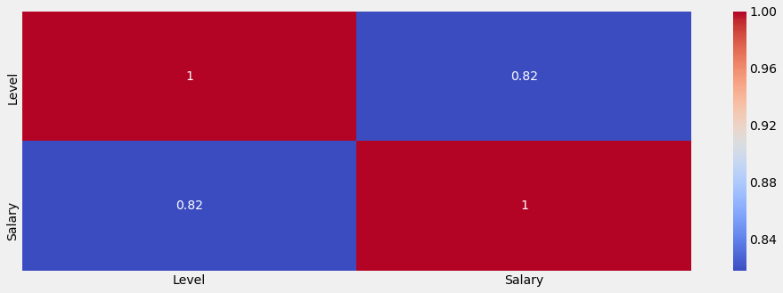
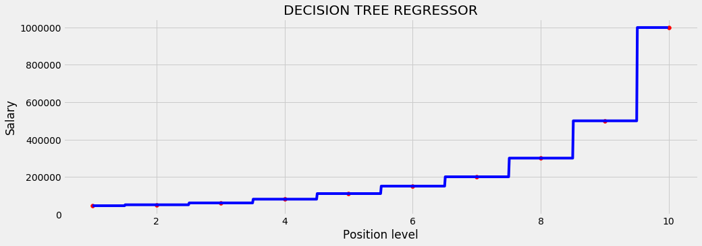

___
# Decision Tree Regression
___

## Imports


```python
# data analysis
import numpy as np
import matplotlib.pyplot as plt
import pandas as pd

# ploting
import seaborn as sns
import matplotlib.pyplot as plt
%matplotlib inline
plt.style.use('fivethirtyeight')
plt.rcParams['figure.figsize'] = (15,5)

# data preprocesing
from sklearn.preprocessing import Imputer #replace missing data
from sklearn.preprocessing import LabelEncoder, OneHotEncoder #encoding categorical data
from sklearn.preprocessing import StandardScaler #feature scaling

#spliting data
from sklearn.model_selection import train_test_split

# models
from sklearn.tree import DecisionTreeRegressor

# metrics
from sklearn.metrics import r2_score, mean_absolute_error, mean_squared_error
from math import sqrt
```

## Exploring the Dataset


```python
dataset = pd.read_csv("Position_Salaries.csv")
```


```python
dataset.head()
```


<div>
<style>
    .dataframe thead tr:only-child th {
        text-align: right;
    }

    .dataframe thead th {
        text-align: left;
    }

    .dataframe tbody tr th {
        vertical-align: top;
    }
</style>
<table border="1" class="dataframe">
  <thead>
    <tr style="text-align: right;">
      <th></th>
      <th>Position</th>
      <th>Level</th>
      <th>Salary</th>
    </tr>
  </thead>
  <tbody>
    <tr>
      <th>0</th>
      <td>Business Analyst</td>
      <td>1</td>
      <td>45000</td>
    </tr>
    <tr>
      <th>1</th>
      <td>Junior Consultant</td>
      <td>2</td>
      <td>50000</td>
    </tr>
    <tr>
      <th>2</th>
      <td>Senior Consultant</td>
      <td>3</td>
      <td>60000</td>
    </tr>
    <tr>
      <th>3</th>
      <td>Manager</td>
      <td>4</td>
      <td>80000</td>
    </tr>
    <tr>
      <th>4</th>
      <td>Country Manager</td>
      <td>5</td>
      <td>110000</td>
    </tr>
  </tbody>
</table>
</div>


```python
dataset.info()
```

    <class 'pandas.core.frame.DataFrame'>
    RangeIndex: 10 entries, 0 to 9
    Data columns (total 3 columns):
    Position    10 non-null object
    Level       10 non-null int64
    Salary      10 non-null int64
    dtypes: int64(2), object(1)
    memory usage: 320.0+ bytes
    


```python
dataset.describe()
```


<div>
<style>
    .dataframe thead tr:only-child th {
        text-align: right;
    }

    .dataframe thead th {
        text-align: left;
    }

    .dataframe tbody tr th {
        vertical-align: top;
    }
</style>
<table border="1" class="dataframe">
  <thead>
    <tr style="text-align: right;">
      <th></th>
      <th>Level</th>
      <th>Salary</th>
    </tr>
  </thead>
  <tbody>
    <tr>
      <th>count</th>
      <td>10.00000</td>
      <td>10.000000</td>
    </tr>
    <tr>
      <th>mean</th>
      <td>5.50000</td>
      <td>249500.000000</td>
    </tr>
    <tr>
      <th>std</th>
      <td>3.02765</td>
      <td>299373.883668</td>
    </tr>
    <tr>
      <th>min</th>
      <td>1.00000</td>
      <td>45000.000000</td>
    </tr>
    <tr>
      <th>25%</th>
      <td>3.25000</td>
      <td>65000.000000</td>
    </tr>
    <tr>
      <th>50%</th>
      <td>5.50000</td>
      <td>130000.000000</td>
    </tr>
    <tr>
      <th>75%</th>
      <td>7.75000</td>
      <td>275000.000000</td>
    </tr>
    <tr>
      <th>max</th>
      <td>10.00000</td>
      <td>1000000.000000</td>
    </tr>
  </tbody>
</table>
</div>


```python
sns.heatmap(dataset.corr(), cmap="coolwarm", annot=True)
```


    <matplotlib.axes._subplots.AxesSubplot at 0x245aec727b8>





## Dataprocesing


```python
X = dataset.iloc[:, 1:2].values
y = dataset.iloc[:, 2].values
```

## Creating and Training the model


```python
regressor = DecisionTreeRegressor(random_state=0)
regressor.fit(X,y)
```


    DecisionTreeRegressor(criterion='mse', max_depth=None, max_features=None,
               max_leaf_nodes=None, min_impurity_decrease=0.0,
               min_impurity_split=None, min_samples_leaf=1,
               min_samples_split=2, min_weight_fraction_leaf=0.0,
               presort=False, random_state=0, splitter='best')


## Perfomance


```python
def plot_performance(X, y, regressor, model_name):
    X_grid = np.arange(min(X), max(X), 0.01)
    X_grid = X_grid.reshape((len(X_grid), 1))
    plt.scatter(X, y, color = 'red')
    y_predict = regressor.predict(X_grid)
    plt.plot(X_grid, y_predict, color = 'blue')
    plt.xlabel('Position level')
    plt.ylabel('Salary')
    plt.title( model_name.upper())
    plt.show()
```


```python
plot_performance(X,y,regressor,"Decision Tree Regressor")
```





```python
regressor.predict(6.5)[0]
```


    150000.0


